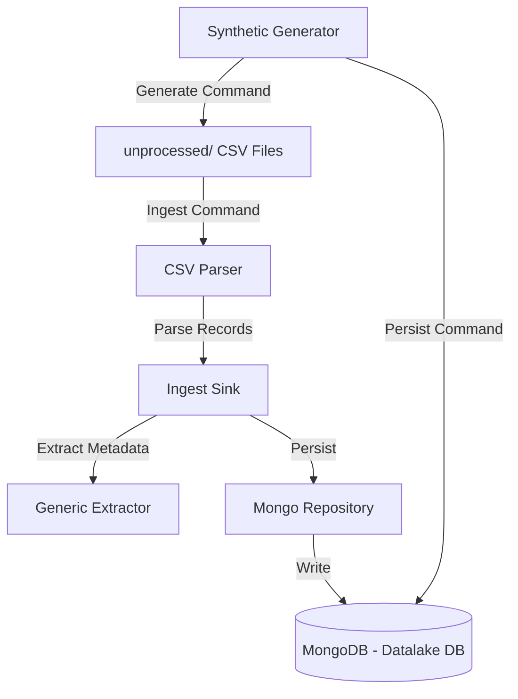

# Architecture & Data Flow

This document details the system design, components, and data flow of the `babylon_data_loader`.

## System Architecture

## Core Components

1. **Entrypoint ([main.go](file:///Users/aponte/personal_workspace/babylon-2.0/babylon_data_loader/main.go))**: Handles command-line arguments and routes requests to either the synthetic data generator or the data ingestion process.
2. **Context & Logging ([appcontext/](file:///Users/aponte/personal_workspace/babylon-2.0/babylon_data_loader/appcontext))**: Standardizes how context propagates with `slog` logger instances attached.
3. **Configuration ([config/](file:///Users/aponte/personal_workspace/babylon-2.0/babylon_data_loader/config))**: Loads database connection details, timeouts, and file paths.
4. **CSV Parser ([csv/](file:///Users/aponte/personal_workspace/babylon-2.0/babylon_data_loader/csv))**: Flexibly parses CSV data with dynamic header mapping.
5. **Datalake Engine ([datalake/](file:///Users/aponte/personal_workspace/babylon-2.0/babylon_data_loader/datalake))**: Represents core business entities, interfaces, and extraction services (like [datasource/](file:///Users/aponte/personal_workspace/babylon-2.0/babylon_data_loader/datalake/datasource)).
6. **Ingest Sink ([ingest/](file:///Users/aponte/personal_workspace/babylon-2.0/babylon_data_loader/ingest))**: Coordinates the flow of reading unprocessed files, invoking the CSV parser, and invoking the repository to save records.
7. **Storage Repository ([storage/](file:///Users/aponte/personal_workspace/babylon-2.0/babylon_data_loader/storage))**: Interacts with MongoDB. Implements bulk upsert actions.
8. **Synthetic Generator ([synthetic/](file:///Users/aponte/personal_workspace/babylon-2.0/babylon_data_loader/synthetic))**: Generates deterministic/random transaction mock datasets to avoid using real PII.

## Data Ingestion Flow

1. The user/system executes `make run-ingest` (which runs `data-loader ingest`).
2. The `ingest.Sink` scans the configured directory (e.g., `unprocessed/`) for CSV files.
3. For each file, the `csv.Parser` maps columns (Account ID, Balance, Posting Date, Details, etc.) to structured structures.
4. The database layer performs a bulk upsert of these records into MongoDB under the target collections (e.g., `transactions_<datasource>`).
