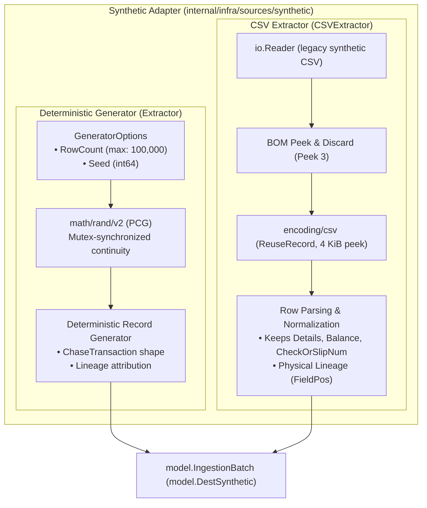

# Synthetic Deterministic Ingestion Adapter Architecture Specification

This document specifies the architectural design, deterministic generation mechanics, and CSV ingestion parser of the Synthetic Ingestion Adapter located in `internal/infra/sources/synthetic/`.

---

## 1. Overview & Architectural Motivation

The synthetic adapter package houses two implementations of `port.Extractor`:

1. **Deterministic Generator (`Extractor`)**: Generates deterministic, strongly-typed `model.ChaseTransaction` batches without requiring disk I/O, external network dependencies, or recorded database fixtures. It powers performance benchmarks, CI/CD integration suites, load tests, and pipeline stress tests.
2. **File CSV Extractor (`CSVExtractor`)**: Ingests legacy synthetic CSV statement files (such as `tmp/synthetic/test-synthetic-data.csv` generated via `make run-generate` and uploaded via `make upload-synthetic` or the desktop dropdown) directly from an `io.Reader` stream.

Both extractors emit `[]model.ChaseTransaction` batches routed to `model.DestSynthetic` (`transactions_synthetic`).


```mermaid
flowchart TD
    subgraph SyntheticPackage ["Synthetic Adapter (internal/infra/sources/synthetic)"]
        subgraph GeneratorEngine ["Deterministic Generator (Extractor)"]
            OPT["GeneratorOptions<br/>• RowCount (max: 100,000)<br/>• Seed (int64)"]
            PRNG["math/rand/v2 (PCG)<br/>Mutex-synchronized continuity"]
            GEN["Deterministic Record Generator<br/>• ChaseTransaction shape<br/>• Lineage attribution"]
        end

        subgraph StreamParser ["CSV Extractor (CSVExtractor)"]
            STREAM["io.Reader (legacy synthetic CSV)"]
            BOM["BOM Peek & Discard (Peek 3)"]
            CSV["encoding/csv (ReuseRecord, 4 KiB peek)"]
            ROW["Row Parsing & Normalization<br/>• Keeps Details, Balance, CheckOrSlipNum<br/>• Physical Lineage (FieldPos)"]
        end
    end

    OPT --> PRNG
    PRNG --> GEN
    GEN --> BATCH["model.IngestionBatch (model.DestSynthetic)"]

    STREAM --> BOM --> CSV --> ROW --> BATCH
```

---

## 2. Deterministic Generation via `math/rand/v2`

The generator adapter utilizes Go's `math/rand/v2` PCG (Permuted Congruential Generator) algorithm (`rand.NewPCG`), ensuring reproducible pseudo-random outputs across platforms:

```go
type GeneratorOptions struct {
	RowCount int
	Seed     int64
}

type Extractor struct {
	opts GeneratorOptions
	mu   sync.Mutex
	rng  *rand.Rand
}

func NewExtractor(opts GeneratorOptions) port.Extractor {
	return &Extractor{
		opts: opts,
		rng:  rand.New(rand.NewPCG(uint64(opts.Seed), 1)),
	}
}
```

### Key Invariants:
1. **RNG State Continuity**: The `*rand.Rand` instance is retained on the struct and guarded with a `sync.Mutex`. Sequential calls to `Extract` produce continuous, non-repeating streams while remaining 100% deterministic when seeded identically.
2. **Thread Safety**: Concurrent extraction across goroutines is synchronized via `e.mu.Lock()`, preventing data races on PRNG internal state.

---

## 3. Memory Safety & Pre-Allocation Clamping

To prevent runaway memory consumption or denial-of-service (DoS) from extreme row count requests in the generator:
- **Maximum Row Bound**: Rejects requests exceeding `MaxSyntheticRowCount = 100_000` with an explicit error.
- **Clamped Pre-Allocation**: Limits initial slice capacity to `min(opts.RowCount, 10_000)` to guard against memory exhaustion during initialization, resizing dynamically as generation proceeds.

---

## 4. Batch Envelope & Record Generation

Generated and parsed records (`model.ChaseTransaction`) satisfy domain validation rules:
- Transaction amounts, dates, descriptions, and running balances populated within realistic financial bounds.
- All batch metadata envelope properties are populated and validated (`batch.Validate()`).
- Ingestion destination is assigned to `model.DestSynthetic`.

---

## 5. Synthetic CSV Extractor (`CSVExtractor`)

`CSVExtractor` parses legacy synthetic CSV files without using the Chase extractor classifier, which would otherwise classify synthetic files with a `Category` column as Chase credit card dialect and discard checking-only fields.

### 5.1 Preservation of Checking-Only Fields
Legacy synthetic files contain checking-only fields that must be preserved:
- `Details`
- `Balance`
- `Check or Slip #`

`CSVExtractor` maps all eight legacy columns into `model.ChaseTransaction` and routes the batch to `model.DestSynthetic`.

### 5.2 Phase 2 Adapter Invariants
1. **Standard-Library Isolation**: Imports only the Go standard library and `internal/domain/*`, strictly adhering to `sources-isolation` depguard rules.
2. **Low-Allocation Row Parsing**: Uses a value-type row reader and `csv.Reader.ReuseRecord = true` with a pre-indexed column lookup table.
3. **Memory-Bounded Inspection**: Buffers streams via `bufio.NewReaderSize(r, csvPeekSize)` (4 KiB) and inspects UTF-8 BOMs with `Peek(3)` without buffering the entire input.
4. **Unwrapped Context Errors**: Context cancellation and deadlines (`context.Canceled`, `context.DeadlineExceeded`) are checked before each row and returned directly without error wrapping.
5. **Physical Lineage Attribution**: Each transaction records physical line numbers derived from `csv.Reader.FieldPos(0)`, ensuring accurate auditability across blank lines and multi-line quoted fields.

### 5.3 Error Taxonomy & Sentinels
- `ErrNilReader`: Supplied `io.Reader` is nil.
- `ErrMissingHeader`: Stream contains no header row.
- `ErrMissingRequiredColumns`: Header row is missing one or more required columns (`Posting Date`, `Description`, `Amount`).
- `ErrMalformedCSV`: CSV syntax error wrapping `*csv.ParseError`.
- `ErrInvalidRow`: Data row validation error wrapping physical line number and the underlying domain sentinel (`model.ErrMissingPostingDate`, `model.ErrMissingDescription`, `model.ErrInvalidAmount`, `model.ErrInvalidBalance`).

### 5.4 Extractor Coexistence & Pipeline Registration
Both `Extractor` and `CSVExtractor` report `SourceType() == "synthetic"`. They are registered in mutually exclusive pipelines:
- `ingest.RegisterDefaults` registers `CSVExtractor` for standard file ingestion (CLI `ingest`, Lambda, desktop).
- The generator `Extractor` is registered only in the dedicated synthetic generation pipeline.
