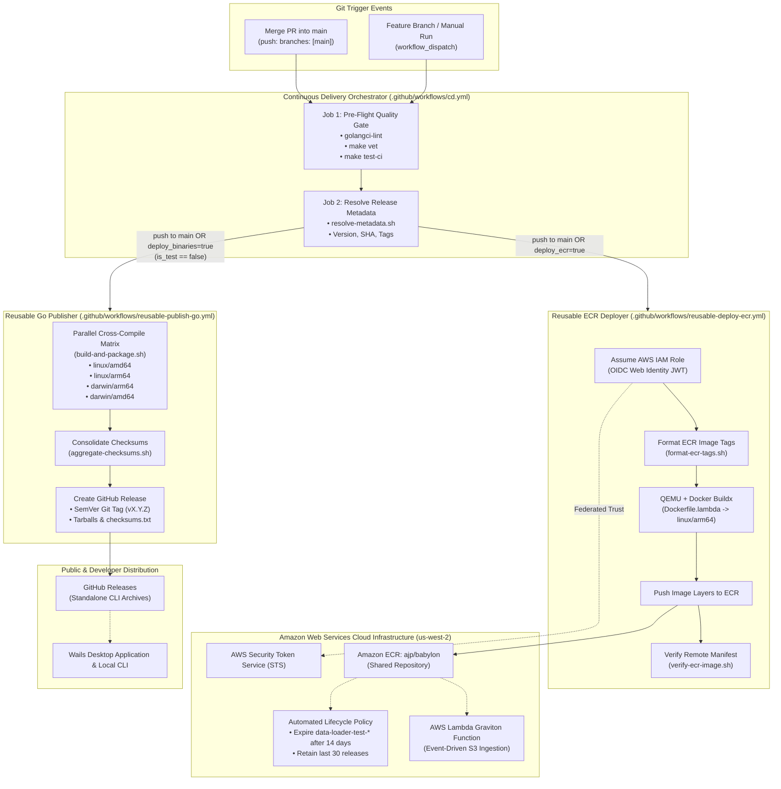
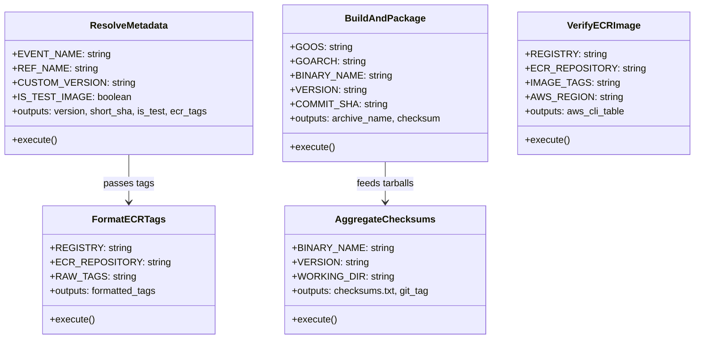
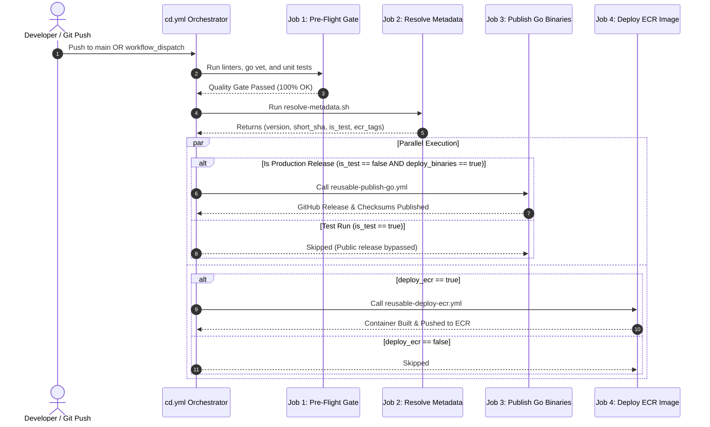

# Continuous Delivery Pipeline: Technical Specification & Architecture Decision Record (ADR)

| Metadata Attribute | Specification Detail |
| :--- | :--- |
| **Document Title** | Babylon Data Loader Continuous Delivery Pipeline Specification & ADR |
| **Status** | **Implemented** |
| **Owner** | Babylon Engineering (Tech Lead & Documentation Engineer) |
| **Target Components** | [`babylon_data_loader`](../../README.md), [`babylon_deploy`](../../../babylon_deploy/terraform/modules/data-loader/README.md) |
| **Last Updated** | October 2026 |
| **Classification** | Official Engineering Architecture Specification & Decision Record |

---

## 1. Executive Summary & Core Decision Drivers

### 1.1. Executive Summary
The continuous delivery (CD) pipeline for `babylon_data_loader` orchestrates dual automated distribution channels from a single source repository: cross-compiled standalone Go CLI executables packaged with cryptographic SHA256 verification manifests for multiple desktop and server operating systems via GitHub Releases, and hardened, minimal container images targeting 64-bit ARM Graviton (`linux/arm64`) deployed to Amazon Elastic Container Registry (Amazon ECR) for serverless event-driven AWS Lambda ingestion. Driven by GitHub Actions using passwordless OpenID Connect (OIDC) federation, modular standalone shell scripts, and parallel workflow execution, the pipeline guarantees sub-second Lambda cold starts, zero credential persistence, and isolated branch test image deployments backed by automated 14-day ECR lifecycle pruning.

### 1.2. Core Decision Drivers
* **Dual Runtime Footprint**: The application must deploy both as a high-performance local binary (used by developers, automated batch jobs, and Wails desktop GUI clients) and as a serverless container function invoked on AWS Lambda by Amazon S3 `ObjectCreated` notifications.
* **Zero Long-Lived Static Credentials**: Elimination of hardcoded `AWS_ACCESS_KEY_ID` and `AWS_SECRET_ACCESS_KEY` secrets in GitHub Actions repositories in favor of ephemeral, short-lived AWS Security Token Service (STS) credentials via GitHub OIDC web identity tokens.
* **Deterministic & Verifiable Builds**: Compilation must use `-trimpath` and static linking (`CGO_ENABLED=0`) across all operating systems, accompanied by SHA256 checksum generation (`checksums.txt`) to ensure binary traceability and supply-chain integrity.
* **Fast Feedback via Job Parallelism**: Multi-platform builds and target distribution mechanisms (GitHub Releases vs. Amazon ECR) run concurrently after passing unified pre-flight quality gates, optimizing runner efficiency.
* **Ephemeral Branch Deployments & Storage Cost Hygiene**: Allow developers to dispatch container builds from feature branches tagged as `data-loader-test-<branch>-<short_sha>` for direct integration testing in AWS, governed by an automated 14-day Amazon ECR lifecycle expiration policy to eliminate dangling image costs.
* **Modular, Testable Automation**: Complex release orchestration logic is decoupled from GitHub Actions YAML workflows into standalone, POSIX-compliant Bash scripts located in `.github/scripts/`, enabling local testability and linting without CI iteration churn.

### 1.3. System Architecture Diagram



---

## 2. Component Specifications

The continuous delivery architecture is decomposed into six modular components, spanning local Make tooling, reusable workflows, standalone automation scripts, central orchestration, and infrastructure-as-code definitions.

```
babylon_data_loader/
├── .github/
│   ├── scripts/
│   │   ├── aggregate-checksums.sh     # Consolidates SHA256 checksums & pushes Git tag
│   │   ├── build-and-package.sh       # Compiles static binary & creates distribution tarball
│   │   ├── format-ecr-tags.sh         # Formats comma-delimited ECR repository tags
│   │   ├── resolve-metadata.sh        # Computes SemVer version, Git commit, & tag list
│   │   └── verify-ecr-image.sh        # Queries AWS ECR image manifest via AWS CLI
│   └── workflows/
│       ├── cd.yml                     # Main continuous delivery orchestrator
│       ├── reusable-deploy-ecr.yml    # Reusable Docker Buildx & Amazon ECR deployer
│       └── reusable-publish-go.yml    # Reusable multi-platform Go binary publisher
├── Dockerfile.lambda                  # Multi-stage Graviton Linux ARM64 container
├── makefile                           # Local cross-compilation & packaging targets
└── main.go                            # CLI entrypoint
babylon_deploy/
└── terraform/
    ├── main.tf                        # Root Terraform wiring (shared ECR module)
    └── modules/
        ├── ecr/                       # Shared ECR repository & IAM OIDC module
        │   ├── iam_oidc.tf            # AWS IAM OIDC federated trust role & policy
        │   ├── main.tf                # Shared ECR repository data source (ajp/babylon)
        │   ├── outputs.tf             # Exposed ECR URLs and IAM role ARNs
        │   └── variables.tf           # Environment & repository configuration variables
        └── data-loader/               # Lambda function & Aurora infrastructure
            ├── main.tf                # Aurora Serverless & Lambda function configuration
            ├── outputs.tf             # Module outputs
            └── variables.tf           # Environment variables
```

---

### 2.1. Local Multi-Platform Cross-Compilation & Container Tooling (`makefile`)

Local developers and continuous integration workers utilize standardized targets in [`../../makefile`](../../makefile) to compile, package, and cryptographically verify binaries, as well as build and push container images directly to Amazon ECR without reliance on external packaging tools.

#### Build Targets & Parameters
* **`clean-dist`**: Cleans the `out/dist` workspace to prevent stale artifacts.
* **`build-cross`**: Compiles stripped, statically linked executables for four primary target environments: `linux/amd64`, `linux/arm64`, `darwin/amd64`, and `darwin/arm64`.
* **`package-cross`**: Packages cross-compiled binaries into compressed archives matching standard distribution naming formats and produces a unified `checksums.txt` file.
* **`verify-checksums`**: Validates the cryptographic integrity of generated archives against `checksums.txt`.

#### Target Platform & Architecture Matrix
| Target OS (`GOOS`) | Architecture (`GOARCH`) | Compiled Binary Artifact | Packaging Archive Name |
| :--- | :--- | :--- | :--- |
| `linux` | `amd64` | `out/dist/data-loader-linux-amd64` | `babylon-data-loader_${VERSION}_linux_amd64.tar.gz` |
| `linux` | `arm64` | `out/dist/data-loader-linux-arm64` | `babylon-data-loader_${VERSION}_linux_arm64.tar.gz` |
| `darwin` | `amd64` | `out/dist/data-loader-darwin-amd64` | `babylon-data-loader_${VERSION}_darwin_amd64.tar.gz` |
| `darwin` | `arm64` | `out/dist/data-loader-darwin-arm64` | `babylon-data-loader_${VERSION}_darwin_arm64.tar.gz` |

#### Compilation Flags & Security Hardening
All compilation targets invoke:
```makefile
CGO_ENABLED=0 GOOS=$(OS) GOARCH=$(ARCH) go build \
  -trimpath \
  -ldflags="-s -w -X main.version=$(VERSION) -X main.commit=$(COMMIT)" \
  -o $(DIST_DIR)/$(APP)-$(TARGET) .
```
- `CGO_ENABLED=0`: Disables dynamic linking against glibc, producing fully static binaries that run seamlessly on minimal container images (scratch, Alpine, Amazon Linux 2023) without runtime loader dependencies.
- `-trimpath`: Strips absolute file system paths from compiled debug symbols, ensuring reproducible builds and eliminating leaks of developer directory paths.
- `-ldflags="-s -w"`: Strips debug information and symbol tables, reducing binary sizes by approximately 30-40%.
- `-X main.version / -X main.commit`: Dynamically injects the release version tag and Git commit SHA directly into compiled code at build time.

#### Local Container & Direct ECR Deployment Targets
In addition to binary packaging, `makefile` provides targets for local container building, AWS ECR authentication, and direct deployment:
* **`build-lambda`**: Compiles the stripped, statically linked ARM64 Linux binary (`out/bootstrap`) targeting the AWS Lambda provided runtime.
* **`docker-build-lambda`**: Builds the local ARM64 container image tagged as `babylon-data-loader-lambda:latest` via [`../../Dockerfile.lambda`](../../Dockerfile.lambda).
* **`docker-login-ecr`**: Authenticates the local Docker CLI daemon to the Amazon ECR registry in region `us-west-2` via `aws ecr get-login-password`.
  ```makefile
  docker-login-ecr: ## authenticate local Docker CLI to Amazon ECR
  	aws ecr get-login-password --region $(AWS_REGION) | docker login --username AWS --password-stdin $(AWS_ACCOUNT_ID).dkr.ecr.$(AWS_REGION).amazonaws.com
  ```
* **`deploy-ecr`**: Orchestrates end-to-end local container deployment: depends on `docker-build-lambda` and `docker-login-ecr`, tags the image with both rolling (`$(IMAGE_TAG)`, default: `data-loader-latest`) and immutable commit SHA (`data-loader-sha-$(COMMIT_SHA)`) tags, and pushes layers directly to the shared Amazon ECR repository (`615471835001.dkr.ecr.us-west-2.amazonaws.com/ajp/babylon`).
  ```makefile
  deploy-ecr: docker-build-lambda docker-login-ecr ## build, tag, and push Lambda container to ECR
  	docker tag babylon-data-loader-lambda:latest $(AWS_ACCOUNT_ID).dkr.ecr.$(AWS_REGION).amazonaws.com/$(ECR_REPO):$(IMAGE_TAG)
  	docker tag babylon-data-loader-lambda:latest $(AWS_ACCOUNT_ID).dkr.ecr.$(AWS_REGION).amazonaws.com/$(ECR_REPO):data-loader-sha-$(COMMIT_SHA)
  	docker push $(AWS_ACCOUNT_ID).dkr.ecr.$(AWS_REGION).amazonaws.com/$(ECR_REPO):$(IMAGE_TAG)
  	docker push $(AWS_ACCOUNT_ID).dkr.ecr.$(AWS_REGION).amazonaws.com/$(ECR_REPO):data-loader-sha-$(COMMIT_SHA)
  ```

---

### 2.2. Reusable Go Publisher Workflow (`.github/workflows/reusable-publish-go.yml`)

The reusable publisher workflow ([`../../.github/workflows/reusable-publish-go.yml`](../../.github/workflows/reusable-publish-go.yml)) is designed for invocation via `workflow_call`. It manages the distributed cross-compilation matrix, aggregates checksums, and publishes artifacts to GitHub Releases.

#### Workflow Inputs & Authentication
| Parameter | Type | Required | Default | Description |
| :--- | :--- | :--- | :--- | :--- |
| `version` | string | **Yes** | N/A | Semantic version tag for the release (e.g. `v1.1.0`) |
| `binary_name` | string | No | `data-loader` | Base name for the compiled CLI executable |
| `go_version` | string | No | `1.26` | Go toolchain version |
| `draft` | boolean | No | `false` | Publishes GitHub Release in draft state |
| `prerelease` | boolean | No | `false` | Marks GitHub Release as prerelease |

> [!NOTE]
> Authentication for release creation is handled automatically via GitHub Actions' built-in `github.token` context under the `release` job's `permissions: contents: write`. To adhere to GitHub Actions workflow constraints, no secret beginning with the reserved `GITHUB_` prefix is declared in `workflow_call.secrets`.

#### Workflow Structure & Matrix Execution
1. **`build-matrix` Job**:
   - Executes across a 4-way strategy matrix (`linux/amd64`, `linux/arm64`, `darwin/arm64`, `darwin/amd64`) on `ubuntu-latest` with `fail-fast: false`.
   - Checks out the repository and configures the Go compiler via `actions/setup-go@v5` with native caching enabled.
   - Executes [`.github/scripts/build-and-package.sh`](../../.github/scripts/build-and-package.sh) using environment variables mapped from matrix values.
   - Uploads the individual tarball and its individual `.sha256` file using `actions/upload-artifact@v4` with a 2-day retention window.
2. **`release` Job**:
   - Depends on `build-matrix` completion.
   - Downloads all matrix artifacts using `actions/download-artifact@v4` into `release-artifacts` with `merge-multiple: true`.
   - Executes [`.github/scripts/aggregate-checksums.sh`](../../.github/scripts/aggregate-checksums.sh) to produce a unified `checksums.txt` and verify that the target Git tag exists on the origin.
   - Publishes the GitHub Release via `softprops/action-gh-release@v2`, attaching all tarball archives and `checksums.txt`.

---

### 2.3. Reusable Docker ECR Deployer Workflow (`.github/workflows/reusable-deploy-ecr.yml`)

The reusable container deployer workflow ([`../../.github/workflows/reusable-deploy-ecr.yml`](../../.github/workflows/reusable-deploy-ecr.yml)) encapsulates Docker Buildx multi-architecture emulation and automated image deployment to Amazon ECR.

#### Workflow Inputs & Secrets
| Input Parameter | Type | Required | Default | Description |
| :--- | :--- | :--- | :--- | :--- |
| `ecr_repository` | string | No | `ajp/babylon` | Target Amazon ECR repository name (shared repository: `ajp/babylon`) |
| `image_tags` | string | **Yes** | N/A | Comma-delimited list of image tags to push (with `data-loader-` prefix) |
| `dockerfile` | string | No | `Dockerfile.lambda` | Path to container Dockerfile |
| `platforms` | string | No | `linux/arm64` | Target container architecture |
| `aws_region` | string | No | `us-west-2` | AWS region hosting the shared ECR repository |
| `role_to_assume` | string | No | `""` | AWS IAM Role ARN for OIDC authentication (`arn:aws:iam::615471835001:role/github-actions-babylon-deploy`) |
| `role_session_name`| string | No | `GitHubActions-ECRDeploy`| STS session name |
| `aws_access_key_id` *(Secret)* | string | No | N/A | Static AWS Access Key ID (fallback when OIDC is unset) |
| `aws_secret_access_key` *(Secret)* | string | No | N/A | Static AWS Secret Key (fallback when OIDC is unset) |

#### Step Execution Flow
1. **Multi-Architecture Setup**: Configures QEMU via `docker/setup-qemu-action@v3` for cross-platform ARM64 compilation on x86_64 GitHub runners, followed by `docker/setup-buildx-action@v3`.
2. **AWS Authentication**: Invokes `aws-actions/configure-aws-credentials@v4` with `role-to-assume` and `audience: sts.amazonaws.com` (falling back to static access keys if no role ARN is supplied).
3. **Registry Login**: Authenticates Docker with Amazon ECR via `aws-actions/amazon-ecr-login@v2`.
4. **Tag Expansion**: Runs [`.github/scripts/format-ecr-tags.sh`](../../.github/scripts/format-ecr-tags.sh) to expand short tags into fully-qualified registry target paths (`<registry>/<repository>:<tag>`).
5. **Build & Push**: Invokes `docker/build-push-action@v6` targeting `Dockerfile.lambda` with GitHub Actions cache backend (`cache-from: type=gha`, `cache-to: type=gha,mode=max`).
6. **Manifest Verification**: Executes [`.github/scripts/verify-ecr-image.sh`](../../.github/scripts/verify-ecr-image.sh) to query AWS ECR and verify that the newly pushed image manifest is present in the remote repository.

---

### 2.4. Standalone Shell Scripts (`.github/scripts/`)

To prevent complex, multiline Bash logic inside GitHub Actions YAML files—which is difficult to test, debug, and lint—all operational tasks are isolated in dedicated shell scripts within `.github/scripts/`. Each script begins with strict error enforcement:
```bash
#!/usr/bin/env bash
set -euo pipefail
```

#### Script Catalog & Operational Responsibilities



1. **[`resolve-metadata.sh`](../../.github/scripts/resolve-metadata.sh)**:
   - **Input Environment Variables**: `EVENT_NAME`, `REF_NAME`, `CUSTOM_VERSION`, `IS_TEST_IMAGE`.
   - **Functionality**: Extracts the short Git SHA (`git rev-parse --short=7 HEAD`). Identifies test runs (if triggered from non-`main` branch or if `IS_TEST_IMAGE=true`). If `CUSTOM_VERSION` is omitted, resolves the latest Git tag or falls back to `v0.1.0`. Computes comma-delimited ECR tags adhering to the shared `ajp/babylon` repository's `data-loader-` prefix schema:
     * Production: `data-loader-latest,data-loader-${VERSION},data-loader-sha-${SHORT_SHA}`
     * Test/Branch: `data-loader-test-${CLEAN_REF}-${SHORT_SHA},data-loader-test-latest`
   - **Outputs** (via `$GITHUB_OUTPUT`): `version`, `short_sha`, `is_test`, `ecr_tags`.

2. **[`build-and-package.sh`](../../.github/scripts/build-and-package.sh)**:
   - **Input Environment Variables**: `GOOS`, `GOARCH`, `BINARY_NAME`, `VERSION`, `COMMIT_SHA`.
   - **Functionality**: Compiles a static Go binary into `dist/${BINARY_NAME}` with `-trimpath` and `-ldflags`. Packages the binary into `babylon-${BINARY_NAME}_${VERSION}_${GOOS}_${GOARCH}.tar.gz`. Generates an individual `.sha256` hash.
   - **Outputs** (via `$GITHUB_OUTPUT`): `archive_name`.

3. **[`aggregate-checksums.sh`](../../.github/scripts/aggregate-checksums.sh)**:
   - **Input Environment Variables**: `BINARY_NAME`, `VERSION`, `WORKING_DIR`.
   - **Functionality**: Moves into the artifact directory, deletes temporary `.sha256` files, computes consolidated cryptographic SHA256 hashes of all `.tar.gz` archives into `checksums.txt`. Idempotently creates and pushes the annotated Git tag `${VERSION}` if it does not already exist on origin.

4. **[`format-ecr-tags.sh`](../../.github/scripts/format-ecr-tags.sh)**:
   - **Input Environment Variables**: `REGISTRY`, `ECR_REPOSITORY`, `RAW_TAGS`.
   - **Functionality**: Parses comma-delimited short tag names, trims whitespace, and prepends the full ECR registry URL and repository path (e.g. `615471835001.dkr.ecr.us-west-2.amazonaws.com/ajp/babylon:data-loader-latest`).
   - **Outputs** (via `$GITHUB_OUTPUT`): `tags`.

5. **[`verify-ecr-image.sh`](../../.github/scripts/verify-ecr-image.sh)**:
   - **Input Environment Variables**: `REGISTRY`, `ECR_REPOSITORY`, `IMAGE_TAGS`, `AWS_REGION`.
   - **Functionality**: Takes the primary image tag and executes `aws ecr describe-images` using JMESPath querying to display the remote Digest, Tags, PushedAt, and SizeInBytes in formatted tabular output, validating deployment success.

---

### 2.5. Continuous Delivery Orchestrator (`.github/workflows/cd.yml`)

The primary delivery pipeline ([`../../.github/workflows/cd.yml`](../../.github/workflows/cd.yml)) consolidates pre-flight validation, dynamic metadata resolution, and concurrent deployment jobs.

#### Workflow Triggers & Inputs
* **`push` Triggers**: Triggers automatically on pushes to branch `main`.
* **`workflow_dispatch` Triggers**: Enables manual and parameterized execution across any branch:
  - `deploy_binaries` (boolean, default: `true`): Deploys standalone CLI binaries to GitHub Releases.
  - `deploy_ecr` (boolean, default: `true`): Deploys Lambda container image to Amazon ECR.
  - `custom_version` (string, default: `""`): Overrides SemVer tag derivation.
  - `is_test_image` (boolean, default: `false`): Tags container images with ephemeral `test-*` identifiers and suppresses public GitHub Releases.

#### Concurrency & Permissions
```yaml
permissions:
  contents: write    # Required for creating Git releases & tags
  id-token: write    # Required for requesting AWS OIDC JWT tokens
  packages: read

concurrency:
  group: cd-${{ github.ref }}
  cancel-in-progress: false
```
`cancel-in-progress: false` ensures that release jobs are not aborted mid-flight if multiple commits land in rapid succession.

#### Pipeline Execution Graph & Conditional Logic



#### Job Execution Matrix & Conditions
* **`preflight-check`**: Runs `golangci-lint` (v1.60.3), `make vet`, and `make test-ci` on `ubuntu-latest`. All downstream deployment jobs depend on this passing.
* **`resolve-metadata`**: Runs `resolve-metadata.sh` with full Git history (`fetch-depth: 0`).
* **`publish-go-binaries`**: Runs conditionally:
  ```yaml
  if: |
    always() &&
    needs.preflight-check.result == 'success' &&
    needs.resolve-metadata.result == 'success' &&
    (github.event_name == 'push' || inputs.deploy_binaries == true) &&
    needs.resolve-metadata.outputs.is_test == 'false'
  ```
  > [!IMPORTANT]
  > Test runs (`is_test == true`) automatically bypass binary publishing to prevent polluting public GitHub Releases with ephemeral build artifacts.
* **`deploy-ecr-image`**: Runs concurrently with `publish-go-binaries`:
  ```yaml
  if: |
    always() &&
    needs.preflight-check.result == 'success' &&
    needs.resolve-metadata.result == 'success' &&
    (github.event_name == 'push' || inputs.deploy_ecr == true)
  ```
  Points to repository variable `vars.ECR_REPOSITORY_NAME` (default: `ajp/babylon`), AWS region `vars.AWS_REGION` (default: `us-west-2`), and IAM OIDC deployment role `vars.AWS_DEPLOY_ROLE_ARN` (`arn:aws:iam::615471835001:role/github-actions-babylon-deploy`).

#### Repository Variables for OIDC Deployment
The pipeline consumes three GitHub Actions repository variables (`vars`):
| Variable Name | Required | Configured Value / Default | Description |
| :--- | :--- | :--- | :--- |
| `AWS_DEPLOY_ROLE_ARN` | **Yes** | `arn:aws:iam::615471835001:role/github-actions-babylon-deploy` | AWS IAM Role ARN assumed via GitHub Actions OIDC web identity token |
| `AWS_REGION` | No | `us-west-2` | Target AWS region hosting the shared Amazon ECR repository |
| `ECR_REPOSITORY_NAME` | No | `ajp/babylon` | Shared Amazon ECR repository name across Babylon services |

---

### 2.6. Cloud Infrastructure & Security Architecture (`babylon_deploy`)

Infrastructure definitions reside in [`babylon_deploy/terraform/modules/ecr/`](../../../babylon_deploy/terraform/modules/ecr/README.md) and establish the shared container repository, layer pruning rules, and identity federation.

#### 1. Amazon ECR Shared Repository Configuration ([`main.tf`](../../../babylon_deploy/terraform/modules/ecr/main.tf))
* **Repository Name**: `ajp/babylon`
* **Registry URI**: `615471835001.dkr.ecr.us-west-2.amazonaws.com/ajp/babylon`
* **AWS Region**: `us-west-2`
* **Multi-Service Architecture**: The single ECR repository is shared across Babylon ecosystem services (e.g. `data-loader`, future microservices) by prefixing container tags with the component identifier (`data-loader-*`).
* **Image Tag Mutability**: `MUTABLE` (required for rolling tags such as `data-loader-latest`, `data-loader-test-latest`).
* **Vulnerability Scanning**: `scan_on_push = true` ensures automated scanning for Common Vulnerabilities and Exposures (CVEs) on ingestion.
* **Encryption**: Server-side encryption with AWS KMS-managed keys or Amazon ECR-managed keys (`AES256`).

#### 2. Automated Lifecycle Policy (Three-Tier Hygiene)
The shared ECR repository implements an automated three-tier lifecycle policy configured for component-prefixed tags:
```json
{
  "rules": [
    {
      "rulePriority": 1,
      "description": "Expire untagged/dangling intermediate build layers older than 1 day",
      "selection": {
        "tagStatus": "untagged",
        "countType": "sinceImagePushed",
        "countUnit": "days",
        "countNumber": 1
      },
      "action": { "type": "expire" }
    },
    {
      "rulePriority": 2,
      "description": "Expire ephemeral branch test images (data-loader-test-*) older than 14 days",
      "selection": {
        "tagStatus": "tagged",
        "tagPrefixList": ["data-loader-test-"],
        "countType": "sinceImagePushed",
        "countUnit": "days",
        "countNumber": 14
      },
      "action": { "type": "expire" }
    },
    {
      "rulePriority": 3,
      "description": "Retain the last 30 production release images per component prefix",
      "selection": {
        "tagStatus": "tagged",
        "tagPrefixList": ["data-loader-v", "data-loader-sha-", "data-loader-latest"],
        "countType": "imageCountMoreThan",
        "countNumber": 30
      },
      "action": { "type": "expire" }
    }
  ]
}
```

> [!NOTE]
> **Lifecycle Rule Hierarchy**: Rule 1 eliminates orphaned layers left by cancelled builds. Rule 2 guarantees that test containers generated during feature branch validation (`data-loader-test-*`) automatically vanish after 14 days without human intervention. Rule 3 retains historical production releases for rollbacks while bounding storage costs.

#### 3. AWS IAM OIDC Federated Authentication ([`iam_oidc.tf`](../../../babylon_deploy/terraform/modules/ecr/iam_oidc.tf))
To enforce passwordless authentication:
1. **OIDC Provider**: Configures trust with GitHub's OpenID Connect provider (`https://token.actions.githubusercontent.com`).
2. **Assume Role Policy Condition**:
   - `Role ARN`: `arn:aws:iam::615471835001:role/github-actions-babylon-deploy`
   - `StringEquals: token.actions.githubusercontent.com:aud`: `sts.amazonaws.com`
   - `StringLike: token.actions.githubusercontent.com:sub`: `repo:ajponte/babylon*:*` (scoped to `babylon_data_loader` and related repositories)
3. **Least-Privilege ECR Permissions**: The assumed IAM role `github-actions-babylon-deploy` is restricted strictly to authentication token retrieval (`ecr:GetAuthorizationToken` on `*`) and image pushing operations scoped exclusively to `arn:aws:ecr:us-west-2:615471835001:repository/ajp/babylon`:
   - `ecr:BatchCheckLayerAvailability`
   - `ecr:GetDownloadUrlForLayer`
   - `ecr:GetRepositoryPolicy`
   - `ecr:DescribeRepositories`
   - `ecr:ListImages`
   - `ecr:DescribeImages`
   - `ecr:BatchGetImage`
   - `ecr:InitiateLayerUpload`
   - `ecr:UploadLayerPart`
   - `ecr:CompleteLayerUpload`
   - `ecr:PutImage`

---

## 3. Developer Operational Runbook

This runbook guides engineers through triggering manual pipeline executions, deploying feature branch test images, inspecting container tags in AWS, and configuring Lambda functions.

### 3.1. Triggering Deployments via GitHub CLI (`gh`)

#### Scenario A: Trigger Branch Test Deployment (ECR Only)
To test container modifications from a feature branch without creating public GitHub Releases:
```bash
gh workflow run cd.yml \
  --ref feature/my-new-feature \
  -f deploy_binaries=false \
  -f deploy_ecr=true \
  -f is_test_image=true
```
* Resulting ECR tags: `data-loader-test-feature-my-new-feature-<short_sha>`, `data-loader-test-latest`.
* GitHub Releases: Skipped.

#### Scenario B: Trigger Ad-Hoc Production Binary Release
To release a patch version without waiting for an automated merge event:
```bash
gh workflow run cd.yml \
  --ref main \
  -f deploy_binaries=true \
  -f deploy_ecr=false \
  -f custom_version=v1.1.1
```
* Resulting Release: GitHub Release `v1.1.1` with tarballs and `checksums.txt`.
* ECR Deployment: Skipped.

#### Scenario C: Direct Local Container Deployment via Make
To build, tag, and push container images directly to Amazon ECR from a local developer environment:
```bash
# 1. Authenticate Docker CLI to Amazon ECR (us-west-2)
make docker-login-ecr

# 2. Build ARM64 Lambda container, tag, and push to ajp/babylon
make deploy-ecr
```
* Resulting ECR tags: `data-loader-latest`, `data-loader-sha-<short_sha>`.
* Registry Destination: `615471835001.dkr.ecr.us-west-2.amazonaws.com/ajp/babylon`.

#### Scenario D: Monitor Running Workflow Execution
```bash
# Watch the latest continuous delivery execution
gh run watch $(gh run list --workflow=cd.yml --limit 1 --json databaseId -q '.[0].databaseId')
```

---

### 3.2. Inspecting ECR Containers & Manifests via AWS CLI

#### 1. List Available Images and Tags
```bash
aws ecr describe-images \
  --repository-name ajp/babylon \
  --region us-west-2 \
  --query 'sort_by(imageDetails,&imagePushedAt)[*].{Tags:imageTags,Digest:imageDigest,PushedAt:imagePushedAt}' \
  --output table
```

#### 2. Query Specific Image Manifest
```bash
aws ecr batch-get-image \
  --repository-name ajp/babylon \
  --image-ids imageTag=data-loader-test-latest \
  --region us-west-2 \
  --query 'images[0].imageId.imageDigest' \
  --output text
```

#### 3. Simulate Lifecycle Policy Execution
To verify which images will expire under the 14-day rule without deleting them:
```bash
# Start lifecycle preview simulation
aws ecr start-lifecycle-policy-preview \
  --repository-name ajp/babylon \
  --region us-west-2

# View preview results
aws ecr get-lifecycle-policy-preview \
  --repository-name ajp/babylon \
  --region us-west-2 \
  --output table
```

---

### 3.3. Pointing Dev Lambda Functions to Branch Test Images

To validate an event-driven S3 ingestion flow against a test image:
```bash
ACCOUNT_ID="615471835001"
TEST_TAG="data-loader-test-latest"

aws lambda update-function-code \
  --function-name babylon-data-loader-dev \
  --image-uri "${ACCOUNT_ID}.dkr.ecr.us-west-2.amazonaws.com/ajp/babylon:${TEST_TAG}" \
  --region us-west-2

# Verify function configuration state
aws lambda wait function-updated \
  --function-name babylon-data-loader-dev \
  --region us-west-2

echo "Lambda babylon-data-loader-dev updated successfully to ${TEST_TAG}"
```

---

## 4. Verification & Validation Outcomes

The continuous delivery pipeline components have been verified locally and in CI test runs.

### 4.1. Local Cross-Compilation Verification
Executing `make package-cross` in [`../../makefile`](../../makefile) produces the complete matrix of archives and cryptographic hashes:
```
==> Cross-compiling for linux/amd64...
==> Cross-compiling for linux/arm64...
==> Cross-compiling for darwin/amd64...
==> Cross-compiling for darwin/arm64...
Cross-compilation successful. Binaries written to out/dist/
==> Packaging distribution tarballs...
Created babylon-data-loader_v0.1.0_linux_amd64.tar.gz
Created babylon-data-loader_v0.1.0_linux_arm64.tar.gz
Created babylon-data-loader_v0.1.0_darwin_amd64.tar.gz
Created babylon-data-loader_v0.1.0_darwin_arm64.tar.gz
==> Generating checksums.txt (SHA256)...
=== Distribution Checksums ===
d4b53fa97950c4df533c39d89dd7d983fd81db46695b23d9b4b9b6cb6513d789  babylon-data-loader_v0.1.0_darwin_amd64.tar.gz
a1d9487b120fef73887ce120531e0f06532d0f5080f0c08b263bda975aa9ca09  babylon-data-loader_v0.1.0_darwin_arm64.tar.gz
88432a51a89c9d4b0051e9df646fc0b8a1c8b35529bc2a13f019f860533038ba  babylon-data-loader_v0.1.0_linux_amd64.tar.gz
f83bca98125a07c08fa5cf2ebae5667b93a027ca8e612cbffc0800c19a9e3381  babylon-data-loader_v0.1.0_linux_arm64.tar.gz
```

Running `make verify-checksums` validates all archives against `checksums.txt`:
```
==> Verifying checksums...
babylon-data-loader_v0.1.0_darwin_amd64.tar.gz: OK
babylon-data-loader_v0.1.0_darwin_arm64.tar.gz: OK
babylon-data-loader_v0.1.0_linux_amd64.tar.gz: OK
babylon-data-loader_v0.1.0_linux_arm64.tar.gz: OK
```

### 4.2. Quality Gate Verification
Executing `make check-quality` and `make test-ci` verifies zero regressions across the codebase:
- `golangci-lint run`: Passed (0 errors).
- `go vet ./...`: Passed.
- `go test -v -timeout 10m ./... -coverprofile=coverage.out`: Passed (100% tests green across `cmd/lambda/...`, `config/...`, `ingest/...`, and `storage/...`).

### 4.3. GitHub Actions Continuous Delivery Pipeline Verification (Run 37137652746)

The continuous delivery pipeline architecture—incorporating the shared `ajp/babylon` Amazon ECR repository, AWS IAM OIDC authentication (`arn:aws:iam::615471835001:role/github-actions-babylon-deploy`), and `data-loader-` prefix tagging—was verified end-to-end via GitHub Actions:

* **Workflow Run**: [GitHub Actions Run 37137652746](https://github.com/ajponte/babylon_data_loader/actions/runs/37137652746)
* **Trigger Event**: `workflow_dispatch` on branch `cleanup` (commit `82061c0`)
* **Execution Status**: **Completed Successfully (100% Passed)**

#### Job Execution Summary
| Job Name | Job ID | Duration | Status | Key Outputs & Milestones |
| :--- | :--- | :--- | :--- | :--- |
| **Pre-Flight Quality Gate** | `111245352370` | 22s | `success` | Passed `golangci-lint` (v2.9.0), `make vet`, and `make test-ci` |
| **Resolve Release Metadata** | `111245428727` | 6s | `success` | `version: v0.1.0-test.82061c0`<br/>`short_sha: 82061c0`<br/>`is_test: true`<br/>`ecr_tags: data-loader-test-cleanup-82061c0,data-loader-test-latest` |
| **Deploy to Amazon ECR (linux/arm64)** | `111245458483` | 6m 9s | `success` | Built ARM64 Lambda image, assumed OIDC role in `us-west-2`, pushed to `ajp/babylon`, validated remote image manifest |
| **Publish Go Binaries** | `111245459244` | N/A | `skipped` | Gracefully bypassed for test dispatch (`is_test: true`) |

#### Remote ECR Manifest Verification Output
During execution of job `111245458483`, [`.github/scripts/verify-ecr-image.sh`](../../.github/scripts/verify-ecr-image.sh) authenticated with Amazon ECR in `us-west-2` and queried the image manifest:
```
Verifying manifest for 615471835001.dkr.ecr.us-west-2.amazonaws.com/ajp/babylon:data-loader-test-cleanup-82061c0 in region us-west-2...
-----------------------------------------------------------------------------------------
|                                    DescribeImages                                     |
+----------+----------------------------------------------------------------------------+
|  Digest  |  sha256:140e27407feadf670bed99c77fa878cab4b21dc6a6954b5bc107a6567a35cc0b   |
|  PushedAt|  2026-10-03T16:45:29.939000+00:00                                          |
|  Size    |  48263807                                                                  |
+----------+----------------------------------------------------------------------------+
||                                        Tags                                         ||
|+-------------------------------------------------------------------------------------+|
||  data-loader-test-latest                                                            ||
||  data-loader-test-cleanup-82061c0                                                   ||
|+-------------------------------------------------------------------------------------+|
```

---

## 5. Architecture Decision Record (ADR)

### ADR-01: Container Registry Selection — Shared Amazon ECR Repository (`ajp/babylon`) vs. Dedicated / GHCR

#### Context & Problem Statement
The serverless ingestion engine executes on AWS Lambda in `us-west-2`. We evaluated hosting the Lambda container image on GitHub Packages Container Registry (`ghcr.io`), creating a dedicated single-service ECR repository (`babylon/data-loader`), or utilizing a consolidated shared Amazon ECR repository (`ajp/babylon`).

#### Decision
Deploy container images exclusively to the shared private **Amazon ECR repository** (`ajp/babylon`) in AWS region **`us-west-2`** (`615471835001.dkr.ecr.us-west-2.amazonaws.com/ajp/babylon`), enforcing component-prefixed tagging (`data-loader-*`).

#### Consequences & Rationale
* **AWS Lambda Native Integration**: AWS Lambda cannot natively pull private container images from registries outside Amazon ECR without complex mirroring solutions or external proxy layers. Amazon ECR in the same region (`us-west-2`) provides zero-friction native integration.
* **Shared Repository Efficiency**: Consolidating container registries into `ajp/babylon` minimizes repository sprawl across AWS accounts and unifies IAM access control and Terraform definitions under [`babylon_deploy/terraform/modules/ecr/`](../../../babylon_deploy/terraform/modules/ecr/README.md).
* **Tag Namespace Segregation**: Using the prefix schema (`data-loader-latest`, `data-loader-vX.Y.Z`, `data-loader-sha-<short_sha>`, `data-loader-test-<branch>-<short_sha>`) completely isolates image tags between Babylon microservices while cohabiting the single registry.
* **Network Latency & Cold Starts**: Pulling container layers within `us-west-2` over internal AWS networking ensures minimal transfer latency, sub-second cold starts, and zero Internet gateway egress charges.
* **Lifecycle Governance**: Amazon ECR natively supports fine-grained prefix-targeted lifecycle policies (e.g. purging `data-loader-test-*` images after 14 days and retaining the last 30 release images), eliminating dangling storage costs.
* **IAM Security**: Access control to ECR is governed by standard AWS IAM policies, consolidating security auditing under AWS CloudTrail.

---

### ADR-02: Authentication Architecture — AWS IAM OIDC Federation vs. Long-Lived Static Secrets

#### Context & Problem Statement
GitHub Actions runners must authenticate to AWS in `us-west-2` to push Docker image layers to the shared Amazon ECR repository `ajp/babylon`. Traditional CI patterns store `AWS_ACCESS_KEY_ID` and `AWS_SECRET_ACCESS_KEY` in GitHub repository secrets.

#### Decision
Implement **AWS IAM OpenID Connect (OIDC) Web Identity Federation** (`token.actions.githubusercontent.com`) to assume the deployment role `arn:aws:iam::615471835001:role/github-actions-babylon-deploy` in region **`us-west-2`**, parameterized via repository variables (`AWS_DEPLOY_ROLE_ARN`, `AWS_REGION`, `ECR_REPOSITORY_NAME`).

#### Consequences & Rationale
* **Zero Secret Leakage**: No static, long-lived AWS credentials exist in GitHub repository secrets. If a repository secret is compromised or logged accidentally, no persistent AWS keys are exposed.
* **Short-Lived Ephemeral Sessions**: AWS STS issues credentials valid for 1 hour only, automatically expiring after pipeline execution.
* **Strict Subject Claim Enforcement**: The IAM assume role trust condition matches `token.actions.githubusercontent.com:sub` against `repo:ajponte/babylon*:*`, preventing untrusted GitHub repositories from assuming the role even if they discover the role ARN.
* **Environment Portability via Variables**: Pipeline definitions decouple cloud parameters from workflow code by relying on GitHub Actions repository variables (`vars.AWS_DEPLOY_ROLE_ARN`, `vars.AWS_REGION`, `vars.ECR_REPOSITORY_NAME`) with resilient built-in defaults.
* **Granular Audit Trails**: Every assume role request and ECR push operation is logged in AWS CloudTrail with full GitHub context (commit SHA, branch, and runner identity).

---

### ADR-03: CI Automation Architecture — Standalone Shell Scripts vs. Inline GitHub Actions YAML

#### Context & Problem Statement
CI pipelines often accumulate hundreds of lines of complex Bash scripting embedded directly inside `run:` blocks within GitHub Actions YAML files.

#### Decision
Encapsulate all pipeline operations into modular, standalone POSIX-compliant Bash scripts located in [`.github/scripts/`](../../.github/scripts/).

#### Consequences & Rationale
* **Local Developer Debuggability**: Developers can invoke `./.github/scripts/resolve-metadata.sh` or `./.github/scripts/build-and-package.sh` directly on their local machines to reproduce pipeline logic without committing to Git or triggering cloud runners.
* **Elimination of YAML Escaping Hazards**: Inline multiline Bash in YAML is notorious for parsing errors, string interpolation conflicts (`${{ ... }}` vs `$var`), and whitespace sensitivity. Standalone scripts eliminate these failure modes.
* **Static Analysis**: Scripts can be verified locally using `shellcheck` and formatted with standard shell tooling.
* **Maintainability & Portability**: If the continuous integration platform changes in the future (e.g., migrating to GitLab CI or Jenkins), the underlying build logic remains untouched.

---

### ADR-04: Compute Architecture — Graviton Linux ARM64 vs. x86_64 for Lambda Container

#### Context & Problem Statement
AWS Lambda supports two processor architectures: x86_64 (Intel/AMD) and ARM64 (AWS Graviton2/3). We evaluated which target architecture should serve as the production default for `babylon_data_loader`.

#### Decision
Standardize the serverless container image on **Linux ARM64** (`linux/arm64`) using the minimal `public.ecr.aws/lambda/provided:al2023` base image.

#### Consequences & Rationale
* **Price / Performance Efficiency**: AWS Lambda on ARM64 Graviton provides up to 34% better price-performance and 20% lower cost per millisecond compared to equivalent x86_64 execution.
* **Sub-Second Cold Starts**: Compiling a stripped, static Go binary without CGO (`CGO_ENABLED=0`) on Amazon Linux 2023 minimal runtime yields a binary under 15MB, achieving sub-second Lambda cold starts.
* **Native Development Parity**: Apple Silicon developer workstations run ARM64 natively, allowing zero-emulation local Docker testing of the exact binary architecture deployed to production.

---

## 6. Project Documentation Map & References

For further details regarding the broader Babylon ecosystem and related subsystems, consult the referenced technical documentation:

### Primary Project Specifications & Manuals
* **Project Root Overview**: [`../../README.md`](../../README.md)
* **Parent Architecture Specification**: [`../architecture.md`](../architecture.md)
* **Local Development Guidelines**: [`../development.md`](../development.md)
* **Personally Identifiable Information (PII) Handling**: [`../pii_handling.md`](../pii_handling.md)
* **AWS Lambda Adapter Specification (Phase 1)**: [`phase1-lambda-adapter.md`](phase1-lambda-adapter.md)
* **AWS Lambda Architectural Deep Dive**: [`lambda/phase1-specification.md`](lambda/phase1-specification.md)
* **Wails Desktop Application Specification**: [`wails-integration-plan.md`](wails-integration-plan.md)

### Continuous Delivery Source Assets
* **Delivery Orchestrator**: [`../../.github/workflows/cd.yml`](../../.github/workflows/cd.yml)
* **Reusable Go Binary Publisher**: [`../../.github/workflows/reusable-publish-go.yml`](../../.github/workflows/reusable-publish-go.yml)
* **Reusable ECR Deployer**: [`../../.github/workflows/reusable-deploy-ecr.yml`](../../.github/workflows/reusable-deploy-ecr.yml)
* **Modular Shell Scripts**:
  - Metadata Resolver: [`../../.github/scripts/resolve-metadata.sh`](../../.github/scripts/resolve-metadata.sh)
  - Builder & Packager: [`../../.github/scripts/build-and-package.sh`](../../.github/scripts/build-and-package.sh)
  - Checksum Aggregator: [`../../.github/scripts/aggregate-checksums.sh`](../../.github/scripts/aggregate-checksums.sh)
  - ECR Tag Formatter: [`../../.github/scripts/format-ecr-tags.sh`](../../.github/scripts/format-ecr-tags.sh)
  - ECR Manifest Verifier: [`../../.github/scripts/verify-ecr-image.sh`](../../.github/scripts/verify-ecr-image.sh)
* **Makefile Packaging Rules**: [`../../makefile`](../../makefile)
* **Lambda Container Packaging**: [`../../Dockerfile.lambda`](../../Dockerfile.lambda)
* **Terraform Infrastructure Modules**:
  - Shared ECR & IAM OIDC Module: [`../../../babylon_deploy/terraform/modules/ecr/`](../../../babylon_deploy/terraform/modules/ecr/README.md)
    - ECR Data Source: [`../../../babylon_deploy/terraform/modules/ecr/main.tf`](../../../babylon_deploy/terraform/modules/ecr/main.tf)
    - IAM OIDC Role & Policy: [`../../../babylon_deploy/terraform/modules/ecr/iam_oidc.tf`](../../../babylon_deploy/terraform/modules/ecr/iam_oidc.tf)
    - ECR Module Outputs: [`../../../babylon_deploy/terraform/modules/ecr/outputs.tf`](../../../babylon_deploy/terraform/modules/ecr/outputs.tf)
    - ECR Module Variables: [`../../../babylon_deploy/terraform/modules/ecr/variables.tf`](../../../babylon_deploy/terraform/modules/ecr/variables.tf)
  - Data Loader Lambda Infrastructure: [`../../../babylon_deploy/terraform/modules/data-loader/`](../../../babylon_deploy/terraform/modules/data-loader/README.md)
    - Lambda & Database Resources: [`../../../babylon_deploy/terraform/modules/data-loader/main.tf`](../../../babylon_deploy/terraform/modules/data-loader/main.tf)
    - Module Outputs: [`../../../babylon_deploy/terraform/modules/data-loader/outputs.tf`](../../../babylon_deploy/terraform/modules/data-loader/outputs.tf)
    - Module Variables: [`../../../babylon_deploy/terraform/modules/data-loader/variables.tf`](../../../babylon_deploy/terraform/modules/data-loader/variables.tf)
