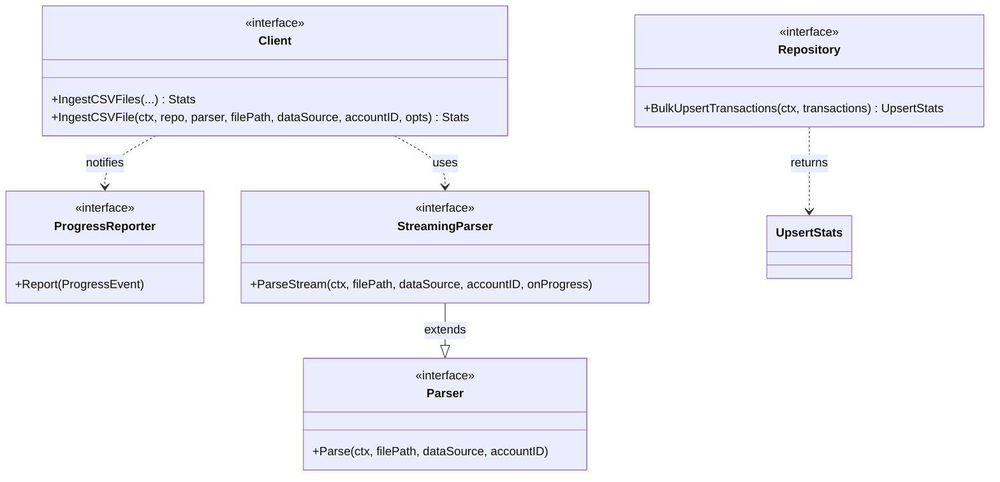
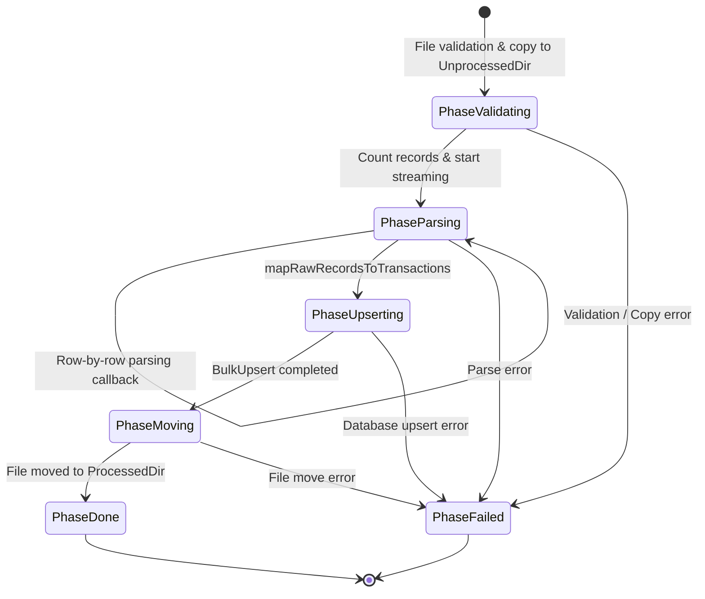

# Phase 1 Specification: Core Go Ingest Pipeline Refactoring

> [!NOTE]
> **The Lead**: This specification outlines the Phase 1 backend changes implemented on the `wails-phase-one` branch to support the desktop app integration defined in [wails-integration-plan.md](../../../agent-docs/wails-integration-plan.md). The changes refactor the Go ingestion pipeline to support single-file processing, stream progress updates row-by-row, and return deduplication/duplicate skip counters, laying a SOLID foundation for the upcoming Wails desktop frontend.

---

## 1. Architectural Changes Overview

The Phase 1 changes focus on decoupling the desktop progress reporting and metrics gathering from the core data ingestion loop. The core data structures and interfaces have been modified to support callback-driven notifications and detailed result statistics:



### 1.1 Ingestion Mechanism: In-place Copy
- Added [IngestCSVFile](../../../datalake/client.go) to the [datalake.Client](../../../datalake/client.go) interface.
- Before a file is processed, it is copied from its source path to the configured `UnprocessedDir`. This preserves the existing directory scanner lifecycle (unprocessed vs. processed directories).
- The operation runs the core ingestion logic against the copied file and handles its relocation to `ProcessedDir` post-ingest.

### 1.2 Deduplication Statistics & Skip Counters
- Modified [repository.Repository](../../../datalake/repository/repository.go) interface to return [UpsertStats](../../../datalake/repository/repository.go).
- Introduced `UpsertStats` containing `UpsertedCount`, `MatchedCount`, and `ModifiedCount`.
- Updated [storage.MongoRepository](../../../storage/mongo_repository.go) to map MongoDB's `BulkWriteResult` fields directly to the new `UpsertStats` struct, capturing exact deduplication figures (matched documents that were skipped).

### 1.3 Streaming CSV Parser
- Introduced the `StreamingParser` interface in [csv/parser.go](../../../csv/parser.go).
- Added `ParseStream` to `DefaultParser` in [csv/csv.go](../../../csv/csv.go), executing progress callbacks for each processed row.
- Implemented double-pass file processing: first pass using `countRecords` counts the total records, and second pass streams rows while reporting real-time progress (`CurrentRecord` and `TotalRecords`).

---

## 2. Technical Specification & Design Patterns

### 2.1 Dependency Inversion (DIP) for Progress Reporting
To avoid coupling the core ingest packages with Wails event-emitting APIs, we defined a clean abstract [ProgressReporter](../../../datalake/progress.go) interface and [ProgressEvent](../../../datalake/progress.go) structures:

```go
type Phase string

const (
	PhaseValidating Phase = "validating"
	PhaseParsing    Phase = "parsing"
	PhaseUpserting  Phase = "upserting"
	PhaseMoving     Phase = "moving"
	PhaseDone       Phase = "done"
	PhaseFailed     Phase = "failed"
)

type ProgressEvent struct {
	Phase          Phase  `json:"phase"`
	Message        string `json:"message,omitempty"`
	FileName       string `json:"fileName,omitempty"`
	CurrentRecord  int64  `json:"currentRecord,omitempty"`
	TotalRecords   int64  `json:"totalRecords,omitempty"`
	UpsertedCount  int64  `json:"upsertedCount,omitempty"`
	DuplicateCount int64  `json:"duplicateCount,omitempty"`
}

type ProgressReporter interface {
	Report(ProgressEvent)
}
```

Wails event handlers in Phase 2 will simply implement this interface and invoke `runtime.EventsEmit(ctx, "ingest:progress", event)`.

### 2.2 Ingestion Phase Progression Flow
The ingestion pipeline transitions through six distinct phases:



---

## 3. Reviews & Verifications

### 3.1 Tech Lead Verification
- **SOLID Design Principles**: Modularity is strictly preserved. `csvparser` remains focused on raw mapping, `storage` focuses on MongoDB operations, and `datalake` coordinates the process. No Wails packages are imported in the backend code.
- **Precision Arithmetic**: Checked currency mapping flows; all amounts are validated as cents using string-based parsing (no floating-point calculations).
- **Quality & Code Health**:
  - Found and fixed a cognitive complexity issue in [csv/csv.go](../../../csv/csv.go#L50). Refactored `ParseStream` by extracting the record parsing loop to `readRecords` helper function, dropping cognitive complexity from 23 to below the strict linter threshold (20).
  - Validated that `make lint` and `make unit-test` pass successfully with zero warnings/errors.
  - Test coverage meets high quality bars: `csv` package achieved **87.2%** test coverage; `datalake` package achieved **51.8%** coverage.

### 3.2 Documentation Engineer Verification
- **Inverted Pyramid Structure**: The document prioritizes the lead context (purpose, goals, most important changes first) before detailing deep Go structure differences and interface signatures.
- **Link Integrity**: Clickable markdown links point directly to specific files and symbols within the repository using relative paths (e.g. `[progress.go](../../../datalake/progress.go)`). No personal absolute paths are referenced.
- **Ubiquitous Language**: Terminology is consistent with the project glossaries: `Transaction`, `DataSource`, `UpsertStats`, `ProgressEvent`.
- **Alert Blocks**: Leveraged markdown alert elements to call out critical patterns and implementation contexts.

---

## 4. References & Links

- **Wails Integration Plan**: [wails-integration-plan.md](../../../agent-docs/wails-integration-plan.md)
- **PII Handling Guidelines**: [pii_handling.md](../../pii_handling.md)
- **Central Harness Index**: [README.md](../../README.md)
