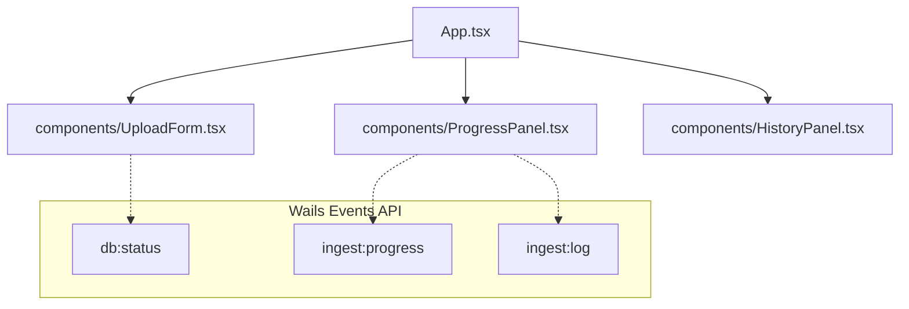

# Phase 3 & 4 Specification: React Frontend & Vitest Suites

> [!NOTE]
> **The Lead**: This specification outlines the Phase 3 (Frontend Integration) and Phase 4 (History View & Vitest Testing) implementation in the Wails desktop app. The frontend has been converted from a placeholder to a premium, dark-themed React + TypeScript dashboard with validation, streaming progress updates, live logging, and historical run tracking. All components are verified via a suite of 15 Vitest unit and integration tests.

---

## 1. Frontend Architecture & Types

The frontend is constructed using React, TypeScript, and Vite, running within Wails v2. Communication between the React app and the Go backend occurs via generated Go bindings and runtime event listeners:



### 1.1 Type Definitions
To ensure strict type-safety, all events are modeled in [events.ts](../../../desktop/frontend/src/types/events.ts):

* **`ProgressEvent`**:
  ```typescript
  export interface ProgressEvent {
    phase: string;
    message: string;
    fileName: string;
    currentRecord: number;
    totalRecords: number;
    upsertedCount: number;
    duplicateCount: number;
  }
  ```
* **`DbStatus`**:
  ```typescript
  export interface DbStatus {
    connected: boolean;
    error?: string;
  }
  ```
* **`SyncLog`**:
  ```typescript
  export interface SyncLog {
    collectionName: string;
    syncTimestamp: string;
    recordsUploaded: number;
  }
  ```
* **`FrontendLog`**:
  ```typescript
  export interface FrontendLog {
    time: string;
    level: string;
    message: string;
    attrs?: Record<string, any>;
  }
  ```

---

## 2. Component Design & Interactions

### 2.1 [UploadForm.tsx](../../../desktop/frontend/src/components/UploadForm.tsx)
The upload form handles user selection, metadata entry, and connection warnings:
- **File Selection**: Leverages Wails native file dialog (`OpenFileDialog`) via the browser window runtime wrapper.
- **Dropdown List**: Restricts input sources to `chase` and `synthetic`.
- **Account ID Input**: Validated to restrict entry to digits only and enforce exactly 4 digits.
- **Offline Banner**: Renders if MongoDB is offline on boot or goes down. Includes a retry button linking directly to Go `RetryConnectDB()`.

### 2.2 [ProgressPanel.tsx](../../../desktop/frontend/src/components/ProgressPanel.tsx)
Displays real-time feedback during ingestion:
- **Progress Bar**: Animates with an indeterminate glow in validating/parsing phases and displays a precise percentage during upserting and done phases.
- **Metrics Grid**: Renders totals, upserted records, and skipped duplicate counts on completion.
- **Live Logs Console**: Subscribes to `ingest:log` events, displaying color-coded slog severity tags inside a scrollable console.

### 2.3 [HistoryPanel.tsx](../../../desktop/frontend/src/components/HistoryPanel.tsx)
Retrieves and displays historical synchronizations:
- Loads previously processed statements from the MongoDB `dataSync` table using the backend `GetHistory` binding.
- Formats date strings to the user's local timezone.
- Features manual refresh buttons for live polling of runs.

---

## 3. Testing Harness & Vitest Verification

Frontend unit tests are set up inside `desktop/frontend/` using **Vitest** and **React Testing Library** under a virtual DOM environment (`jsdom`).

### 3.1 Test Cases Covered
- **[UploadForm.test.tsx](../../../desktop/frontend/src/components/UploadForm.test.tsx)** (7 tests):
  * Verifies correct input and button rendering.
  * Asserts validation errors block submit when inputs are empty or invalid.
  * Asserts character-blocking pattern on the Account ID field (disallows non-digits).
  * Mocks `window.runtime.OpenFileDialog` to test browse selection.
  * Validates database offline alerts and retry connection calls.
- **[ProgressPanel.test.tsx](../../../desktop/frontend/src/components/ProgressPanel.test.tsx)** (4 tests):
  * Verifies placeholder states when no active event is broadcasted.
  * Simulates progress events and asserts that labels and percentages update dynamically.
  * Validates color-coded log parsing inside the live console.
  * Asserts the "Done" callback behaves properly on compilation.
- **[HistoryPanel.test.tsx](../../../desktop/frontend/src/components/HistoryPanel.test.tsx)** (4 tests):
  * Verifies spinner loading indicator.
  * Asserts empty folder icons render when sync history is clean.
  * Verifies record rendering matching fetched array collections.
  * Asserts grace-handling on API failure.

---

## 4. Verification & Linting Status

- **Go Backend Coverage**: **86.3%** of statements in `desktop/`.
- **Frontend Test Suite**: **15 tests passed** successfully.
- **Linter Status**: All linter rules check out with **0 issues**.

---

## 5. References & Links

- **Wails Integration Plan**: [wails-integration-plan.md](../../../agent-docs/wails-integration-plan.md)
- **Phase 2 Specification**: [phase2-specification.md](phase2-specification.md)
- **PII / Compliance Guidelines**: [pii_handling.md](../../pii_handling.md)
