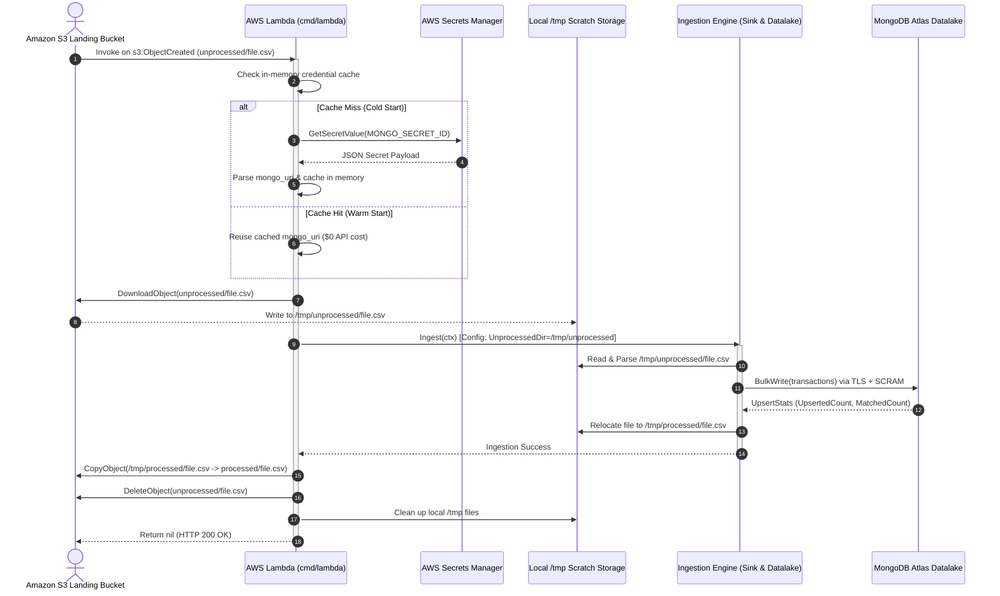

# Phase 1 Specification: AWS Lambda Serverless Adapter & ARM64 Packaging

> [!NOTE]
> **Tech Lead Note**: This specification establishes the Phase 1 cloud-native serverless architecture implemented on the `feature/lambda-adapter` branch for [babylon_data_loader](file://../../..). It enables event-driven S3 ingestion executed on **AWS Lambda** (ARM64 Graviton) backed by AWS Secrets Manager credential caching and multi-stage container packaging, while maintaining 100% backward compatibility with the existing CLI and local desktop workflows.

---

## 1. Executive Summary & Core Objectives

Phase 1 provides the code, dependencies, interfaces, and container packaging required to run `babylon_data_loader` as an **AWS Lambda** serverless container function without disrupting the existing CLI (`main.go`), synthetic data generator, or Wails desktop application.

### Key Objectives:
1. **Serverless Event-Driven Compute**: Subscribe to Amazon S3 `ObjectCreated` events in `s3://${bucket}/unprocessed/*.csv`, executing file downloads to local `/tmp`, processing through the core ingestion engine, and archiving to `s3://${bucket}/processed/`.
2. **Secrets Manager Integration & In-Memory Caching**: Retrieve MongoDB Atlas database connection credentials securely from AWS Secrets Manager (`babylon/${environment}/datalake/credentials`) with local environment variable fallback (`MONGO_URI`) and thread-safe in-memory caching to eliminate redundant API calls across warm Lambda invocations.
3. **Storage & Cloud Provider Abstraction**: Provide decoupled interfaces for S3 operations (`storage.S3Client` and `storage.S3Storage`) and Secrets Manager (`config.SecretsClient`) to enable 100% mock unit test coverage without cloud dependencies.
4. **ARM64 Graviton Container Packaging**: Multi-stage container image based on `public.ecr.aws/lambda/provided:al2023` producing a stripped, statically linked Linux/ARM64 binary for sub-second cold starts and optimal price-performance on Graviton.
5. **Zero Disruption to Existing Tooling**: Keep all existing commands (`make`, `make check-quality`, `make unit-test`, `make run`, `make run-desktop`) fully operational.

---

## 2. Technical Architecture & Lifecycle Flow



### Ingestion Lifecycle Stages:
1. **Event Receipt & Filtering**: Lambda receives `events.S3Event`. Keys are URL-decoded. Events outside `unprocessed/` or non-`.csv` files are skipped gracefully.
2. **Credential Resolution**: Check thread-safe memory cache. If cold, fetch from Secrets Manager, parse JSON or direct URI, and store in cache.
3. **Staging & Isolation**: Create scratch directories `/tmp/unprocessed` and `/tmp/processed`. Download the S3 object locally via streaming `io.Copy`.
4. **Ingestion Execution**: Execute `ingest.Sink` which parses the CSV, validates transactions, and bulk-upserts into MongoDB Atlas. On completion, the engine moves the file to `/tmp/processed`.
5. **Archival & Cleanup**: Copy the processed file to `s3://${bucket}/processed/${filename}`, delete the original from `unprocessed/`, and remove temporary `/tmp` scratch files.

---

## 3. Component Specifications & Interfaces

### 3.1. Go Dependencies ([`go.mod`](../../../go.mod))
Added AWS SDK v2 and Lambda libraries, fully vendored in `vendor/`:
```go
require (
    github.com/aws/aws-lambda-go v1.55.0
    github.com/aws/aws-sdk-go-v2 v1.47.0
    github.com/aws/aws-sdk-go-v2/config v1.33.4
    github.com/aws/aws-sdk-go-v2/service/s3 v1.113.1
    github.com/aws/aws-sdk-go-v2/service/secretsmanager v1.49.0
    go.mongodb.org/mongo-driver v1.17.4
)
```

---

### 3.2. Secrets Manager Credential Helper ([`config/secrets.go`](../../../config/secrets.go))
Provides structured JSON parsing, URI reconstruction, environment fallback, and thread-safe in-memory caching.

#### Interface & Data Structures:
```go
// MongoCredentials models the structured JSON stored in AWS Secrets Manager.
type MongoCredentials struct {
    Engine     string `json:"engine"`
    Host       string `json:"host"`
    Port       string `json:"port"`
    Username   string `json:"username"`
    Password   string `json:"password"`
    Database   string `json:"database"`
    AuthSource string `json:"auth_source"`
    MongoURI   string `json:"mongo_uri"`
}

// SecretsClient defines the interface for fetching secret strings (for easy mocking).
type SecretsClient interface {
    GetSecretValue(
        ctx context.Context,
        params *secretsmanager.GetSecretValueInput,
        optFns ...func(*secretsmanager.Options),
    ) (*secretsmanager.GetSecretValueOutput, error)
}
```

#### Precedence Resolution Logic:
1. **Local Override**: If `os.Getenv("MONGO_URI")` is populated, return immediately (used for local CLI and integration tests).
2. **In-Memory Cache**: Guarded by `sync.RWMutex`. Read-lock returns `cachedMongoURI` instantly with 0 AWS network calls.
3. **AWS Secrets Manager**: If cache misses, acquire write lock (double-checked locking pattern), fetch from Secrets Manager using `secretID` or `os.Getenv("MONGO_SECRET_ID")`.
4. **Flexible Parsing**: Supports:
   - Structured JSON with explicit `mongo_uri` field.
   - Structured JSON with component fields (`host`, `port`, `username`, `password`, `database`, `auth_source`).
   - Plaintext MongoDB connection string (`mongodb://` or `mongodb+srv://`).
   - Binary secret payloads (`SecretBinary`).

---

### 3.3. S3 Storage Helper & Client Abstraction ([`storage/s3.go`](../../../storage/s3.go))
Decouples AWS S3 API calls from the Lambda handler to facilitate testing:

```go
type S3Client interface {
    GetObject(ctx context.Context, params *s3.GetObjectInput, optFns ...func(*s3.Options)) (*s3.GetObjectOutput, error)
    CopyObject(ctx context.Context, params *s3.CopyObjectInput, optFns ...func(*s3.Options)) (*s3.CopyObjectOutput, error)
    DeleteObject(ctx context.Context, params *s3.DeleteObjectInput, optFns ...func(*s3.Options)) (*s3.DeleteObjectOutput, error)
}

type S3Storage struct {
    client S3Client
}

func NewS3Storage(client S3Client) *S3Storage
func (s *S3Storage) Download(ctx context.Context, bucket, key, localPath string) error
func (s *S3Storage) Copy(ctx context.Context, srcBucket, srcKey, destBucket, destKey string) error
func (s *S3Storage) Delete(ctx context.Context, bucket, key string) error
```

- **Streaming Download**: Streams `out.Body` directly to disk using `io.Copy`, ensuring directories are created with `0750` permissions.
- **Copy Validation**: Automatically trims key slashes and formats `CopySource` as `${srcBucket}/${srcKey}`.
- **Error Propagation**: Wraps S3 API errors with context details.

---

### 3.4. Lambda Handler Entrypoint ([`cmd/lambda/main.go`](../../../cmd/lambda/main.go))
The main execution entrypoint for AWS Lambda:

#### Handler Structure & Dependency Injection:
```go
type Handler struct {
    s3Storage     S3StorageService
    secretsClient config.SecretsClient
    secretID      string
    tmpDir        string
    ingestRunner  IngestRunner
    logger        *slog.Logger
}

func NewHandler(...) *Handler
func (h *Handler) HandleS3Event(ctx context.Context, event events.S3Event) error
```

#### Key Processing Features:
- **URL-Decoded S3 Keys**: Handles AWS S3 event key encoding (e.g., `synthetic%2Bdata.csv` decoded to `synthetic+data.csv`).
- **Prefix & Extension Filtering**: Filters objects to only process `unprocessed/*.csv`. Skips directory creation events or irrelevant file formats without failing the Lambda invocation.
- **Temporary Disk Isolation**: Uses configurable `tmpDir` (default `/tmp`) and cleans up scratch files using deferred removal.
- **Core Engine Dispatch**: Constructs `config.Config` and executes `ingest.Sink` using the identical wiring as the production CLI.

---

## 4. Container Packaging & Build Automation

### 4.1. Multi-Stage ARM64 Dockerfile ([`Dockerfile.lambda`](../../../Dockerfile.lambda))
Optimized for AWS Lambda Graviton2 provided runtime:

```dockerfile
# Stage 1: Build static ARM64 binary
FROM golang:1.26-alpine AS builder

WORKDIR /app
RUN apk add --no-cache git ca-certificates

COPY go.mod go.sum ./
RUN go mod download

COPY . .

# Compile entrypoint for ARM64 Graviton
RUN CGO_ENABLED=0 GOOS=linux GOARCH=arm64 go build -ldflags="-s -w" -o /bootstrap ./cmd/lambda

# Stage 2: Minimal AWS Lambda runtime image
FROM public.ecr.aws/lambda/provided:al2023

COPY --from=builder /bootstrap /var/runtime/bootstrap
COPY --from=builder /etc/ssl/certs/ca-certificates.crt /etc/ssl/certs/

CMD ["/var/runtime/bootstrap"]
```

### 4.2. Build Context Optimization ([`.dockerignore`](../../../.dockerignore))
To prevent sending local binaries, test coverage profiles, and frontend `node_modules` to the Docker daemon, [`.dockerignore`](../../../.dockerignore) excludes:
- `.git/` and `.github/`
- `out/` and `bin/`
- `*.out`, `*.test`, `coverage.*`, `report.json`
- `desktop/frontend/node_modules/`, `desktop/frontend/dist/`, `desktop/build/bin/`
- `tmp/`, `data/unprocessed/*.CSV`, `data/processed/*.CSV`

**Context Reduction**: Reduced context transfer from **235.52 MB** to **1.16 MB** (~99.5% reduction), cutting build times to ~11s.

### 4.3. Makefile Targets ([`makefile`](../../../makefile))
```makefile
## Lambda Targets
build-lambda: ## build static linux/arm64 binary for lambda
	mkdir -p out/
	CGO_ENABLED=0 GOOS=linux GOARCH=arm64 go build -ldflags="-s -w" -o out/bootstrap ./cmd/lambda

docker-build-lambda: ## build arm64 lambda container image
	docker build -f Dockerfile.lambda -t babylon-data-loader-lambda:latest .

test-lambda: ## run unit tests for lambda handler and secrets
	go test -v -race ./cmd/lambda/... ./config/...
```

---

## 5. Testing & Verification Strategy

All components are covered by unit tests using mock AWS SDK clients and race detection:

| Test Suite | File | Coverage Areas | Result |
| :--- | :--- | :--- | :---: |
| **Secrets Manager Tests** | [`config/secrets_test.go`](../../../config/secrets_test.go) | `MONGO_URI` env fallback, JSON secret parsing, component URI building, plaintext URI, binary secrets, cache hits, 20-goroutine concurrent access, error handling | **PASS (100%)** |
| **S3 Storage Tests** | [`storage/s3_test.go`](../../../storage/s3_test.go) | Download success/error/validation, Copy success/error/validation, Delete success/error/validation | **PASS (100%)** |
| **Lambda Handler Tests** | [`cmd/lambda/main_test.go`](../../../cmd/lambda/main_test.go) | Non-CSV filtering, prefix filtering, URL-decoded key unescaping, download errors, secret resolution errors, ingest errors, copy errors, delete errors, success path, MongoDB connect errors | **PASS (100%)** |
| **Code Quality Gate** | `make check-quality` | `golangci-lint` (0 issues), `go vet`, `gofumpt`, `goimports` | **PASS (100%)** |
| **Full Regression Suite** | `make all` | Quality gate + all package unit tests with coverage + CLI binary build | **PASS (100%)** |

---

## 6. Phase 2 Handoff & Terraform Contract

This specification provides the foundation for **Phase 2 (Terraform deployment in `babylon_deploy`)**. The Terraform module (`modules/data-loader`) will consume the following contracts:

### 6.1. Container & Runtime Specifications
- **ECR Repository**: `babylon/data-loader`
- **Architectures**: `["arm64"]`
- **Image URI**: `${aws_ecr_repository.data_loader.repository_url}:latest`
- **Package Type**: `Image`
- **Memory Size**: `512` MB
- **Timeout**: `300` seconds (5 minutes)

### 6.2. Environment Variables Contract
| Variable | Required | Purpose |
| :--- | :--- | :--- |
| `MONGO_SECRET_ID` | Yes | Secrets Manager secret ARN or name (`babylon/${var.environment}/datalake/credentials`) |
| `LAMBDA_TMP_DIR` | No | Scratch working directory (default: `/tmp`) |
| `AWS_REGION` | Yes | Injected automatically by AWS Lambda runtime |

### 6.3. IAM Execution Role Contract
Terraform will attach an IAM policy with least-privilege permissions:
```json
{
  "Version": "2012-10-17",
  "Statement": [
    {
      "Effect": "Allow",
      "Action": ["secretsmanager:GetSecretValue"],
      "Resource": "arn:aws:secretsmanager:*:*:secret:babylon/*/datalake/credentials*"
    },
    {
      "Effect": "Allow",
      "Action": [
        "s3:GetObject",
        "s3:PutObject",
        "s3:DeleteObject"
      ],
      "Resource": [
        "arn:aws:s3:::${landing_bucket}/unprocessed/*",
        "arn:aws:s3:::${landing_bucket}/processed/*"
      ]
    },
    {
      "Effect": "Allow",
      "Action": [
        "logs:CreateLogGroup",
        "logs:CreateLogStream",
        "logs:PutLogEvents"
      ],
      "Resource": "arn:aws:logs:*:*:log-group:/aws/lambda/*"
    }
  ]
}
```
