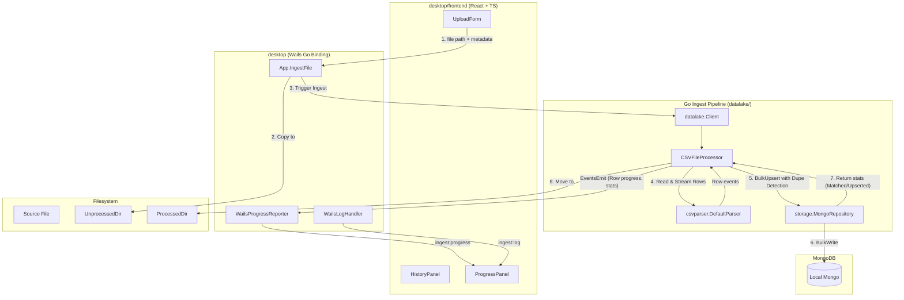

# Wails Integration Plan

> [!NOTE]
> **The Lead**: This integration plan defines the implementation details for wrapping the `babylon/dataloader` Go ingest pipeline inside a Wails v2 desktop application located in the `desktop/` directory. The application enables users to select files through native file dialogs and explicitly define their metadata (data source and account ID), bypassing automatic filename parsing. The integration is structured into five sequential, test-verified phases, covering: core Go pipeline refactoring (unprocessed directory copying, streaming row-level progress, and deduplication stats), desktop app scaffold with persistent Mongo connection, React+TS frontend upload UI with progress metrics, ingest history panel with Vitest testing, and CI/CD/macOS build packaging.

- **Status**: Approved (v1.0)
- **Open Questions Ref**: [Wails Open Questions](wails-open-questions.md) (deep-linked as [Q#](wails-open-questions.md#q1-target-users--environment))

---

## 1. Goals & Non-Goals

### In scope (v1)
- A desktop binary (Wails v2) that wraps the `babylon/dataloader` ingest pipeline under the `desktop/` directory.
- Single-file CSV upload via OS file picker. The file is copied to the configured [UnprocessedDir](../datalake/datalake.go#L45) before ingestion, running the existing [IngestCSVFiles](../datalake/client.go#L15) flow ([Q5](wails-open-questions.md#q5-file-destination)).
- Explicit `dataSource` + `accountID` selection in the UI (bypassing filename heuristic) ([Q8](wails-open-questions.md#q8-filename-derived-metadata-is-a-hard-coupling)).
- Fixed list of supported data sources (`Chase`, `Synthetic`) in the UI dropdown ([Q9](wails-open-questions.md#q9-supported-data-sources)).
- A single, persistent MongoDB client reused for the app's lifetime ([Q13](wails-open-questions.md#q13-persistent-vs-per-action-connection)).
- Graceful startup handling where a connection failure to MongoDB launches the app in a degraded "no DB" mode with a banner ([Q14](wails-open-questions.md#q14-connection-failure-handling)).
- Row-level streaming progress reporting (`validating` -> `parsing` -> `upserting` -> `moving` -> `done`/`failed`) using Wails' `runtime.EventsEmit` bridge ([Q10](wails-open-questions.md#q10-granularity), [Q11](wails-open-questions.md#q11-phases-to-expose), [Q12](wails-open-questions.md#q12-wails-event-channel)).
- Expose deduplication stats (skipped row count) in the UI by capturing matched write counts from bulk write results ([Q7](wails-open-questions.md#q7-re-ingest-behavior)).
- Ingest history panel showing logs and historical runs ([Q16](wails-open-questions.md#q16-ui-complexity)).
- Frontend test harness using Vitest ([Q21](wails-open-questions.md#q21-frontend-testing)).
- Automated Wails build step in GitHub Actions CI/CD ([Q20](wails-open-questions.md#q20-wails-build-in-ci)).
- Target macOS environment primarily, preserving existing CLI commands alongside the desktop app ([Q3](wails-open-questions.md#q3-platform-targets), [Q2](wails-open-questions.md#q2-replacement-vs-addition)).

### Explicitly deferred
- Drag-and-drop batch upload ([Q4](wails-open-questions.md#q4-single-vs-batch-upload)).
- Deleting uploaded files (files are copied to [UnprocessedDir](../datalake/datalake.go#L45) and then automatically moved to [ProcessedDir](../datalake/datalake.go#L46) post-ingest) ([Q6](wails-open-questions.md#q6-post-ingest-file-handling), [Q19](wails-open-questions.md#q19-uploaded-file-storage)).
- Fully replacing the CLI. The CLI and [run-ingest](../makefile#L85) flow remain fully supported ([Q2](wails-open-questions.md#q2-replacement-vs-addition)).

---

## 2. Architecture Overview



Key idea: The desktop layer acts as a thin shell around our core Go package code. The [datalake](../datalake/), [csv](../csv/), and [storage](../storage/) modules are refactored to support row-by-row stream callbacks and deduplication/skip statistics.

---

## 3. Repo Layout

Rename the project directory from `wails/` to `desktop/` to prevent tool-specific directory nesting ([Q17](wails-open-questions.md#q17-repo-layout)).

```text
babylon_data_loader/
├── main.go                       # CLI, unchanged
├── go.mod                        # module babylon/dataloader (unchanged)
├── datalake/                     # refactored for progress & stats (Phase 1)
├── csv/                          # refactored for streaming (Phase 1)
├── storage/                      # refactored for bulk write stats (Phase 1)
└── desktop/                      # Wails desktop application root (Phase 2)
    ├── wails.json                # Wails v2 project config
    ├── main.go                   # wails.Run, App wiring
    ├── app.go                    # App struct: bindings + lifecycle
    ├── progress.go               # WailsProgressReporter
    ├── logbridge.go              # slog.Handler that emits ingest:log events
    └── frontend/
        ├── package.json
        ├── vite.config.ts
        ├── index.html
        └── src/
            ├── main.tsx
            ├── App.tsx
            ├── components/
            │   ├── UploadForm.tsx
            │   ├── ProgressPanel.tsx
            │   └── HistoryPanel.tsx
            └── types/
                └── events.ts     # mirrors Go event payload shapes
```

---

## 4. Backend Changes to Existing Packages

### 4.1 Ingestion Mechanism: In-place Copy (Q5)
When `App.IngestFile` is called, the file is copied to the configured [UnprocessedDir](../datalake/datalake.go#L45) before processing. This ensures the scanner validation and processed folder lifecycle are uniformly preserved.

Add `IngestCSVFile` to the [datalake.Client](../datalake/client.go#L14) interface:
```go
type Client interface {
    IngestCSVFiles(
        ctx context.Context,
        repo repository.Repository,
        extractor datasource.InfoExtractor,
        parser csvparser.Parser,
        unprocessedDir string,
        processedDir string,
        moveProcessedFiles bool,
    ) (*Stats, error) // existing, unchanged

    // NEW
    IngestCSVFile(
        ctx context.Context,
        repo repository.Repository,
        parser csvparser.Parser,
        filePath string,
        dataSource string,
        accountID string,
        opts IngestFileOptions,
    ) (*Stats, error)
}

type IngestFileOptions struct {
    MoveProcessedFiles bool
    ProcessedDir       string
    Reporter           ProgressReporter
}
```

### 4.2 Deduplication Statistics & Skip Counters (Q7)
Update the [Repository](../datalake/repository/repository.go#L10) interface and return a custom stats object:
```go
type UpsertStats struct {
    UpsertedCount int64
    MatchedCount  int64
    ModifiedCount int64
}

type Repository interface {
    BulkUpsertTransactions(ctx context.Context, transactions []model.Transaction) (UpsertStats, error)
}
```
Implement in `storage/mongo_repository.go` using MongoDB's `BulkWriteResult`:
```go
res, err := collection.BulkWrite(ctx, models, options.BulkWrite().SetOrdered(false))
if err != nil {
    return UpsertStats{}, fmt.Errorf("failed to perform bulk write: %w", err)
}
return UpsertStats{
    UpsertedCount: res.UpsertedCount,
    MatchedCount:  res.MatchedCount,
    ModifiedCount: res.ModifiedCount,
}, nil
```

### 4.3 Streaming CSV Parser (Q10)
Update [csvparser.Parser](../csv/parser.go#L6) to support a streaming/row-level callback. This allows the backend to stream rows and report progress incrementally, preventing memory exhaustion on larger files:
```go
type RowProgress struct {
    CurrentRecord int64
    TotalRecords  int64
}

type RowProgressCallback func(progress RowProgress)

type StreamingParser interface {
    Parser
    ParseStream(
        ctx context.Context,
        filePath string,
        dataSource string,
        accountID string,
        onProgress RowProgressCallback,
    ) ([]map[string]string, int64, error)
}
```

---

## 5. Progress Reporting Design

We report row-level and phase-level progress using `runtime.EventsEmit` via an interface-injected reporter ([Q10](wails-open-questions.md#q10-granularity), [Q11](wails-open-questions.md#q11-phases-to-expose), [Q12](wails-open-questions.md#q12-wails-event-channel)).

### 5.1 Interface
New file: [datalake/progress.go](../datalake/progress.go).
```go
package datalake

type Phase string

const (
    PhaseValidating Phase = "validating"
    PhaseParsing    Phase = "parsing"
    PhaseUpserting  Phase = "upserting"
    PhaseMoving     Phase = "moving"
    PhaseDone       Phase = "done"
    PhaseFailed     Phase = "failed"
)

type ProgressEvent struct {
    Phase          Phase  `json:"phase"`
    Message        string `json:"message,omitempty"`
    FileName       string `json:"fileName,omitempty"`
    CurrentRecord  int64  `json:"currentRecord,omitempty"`
    TotalRecords   int64  `json:"totalRecords,omitempty"`
    UpsertedCount  int64  `json:"upsertedCount,omitempty"`
    DuplicateCount int64  `json:"duplicateCount,omitempty"`
}

type ProgressReporter interface {
    Report(ProgressEvent)
}
```

---

## 6. Mongo Lifecycle & Degraded Startup

Establish one long-lived client on startup. If the Mongo server is unreachable at startup, the app enters a degraded "no DB" mode, warning the user in a banner rather than crashing ([Q13](wails-open-questions.md#q13-persistent-vs-per-action-connection), [Q14](wails-open-questions.md#q14-connection-failure-handling)).

### [desktop/app.go](../desktop/app.go)
```go
type App struct {
    ctx      context.Context
    cfg      *config.Config
    mongo    storage.MongoClient
    repo     repository.Repository
    parser   csvparser.Parser
    datalake datalake.Client
    reporter *WailsProgressReporter
}

func (a *App) OnStartup(ctx context.Context) {
    a.ctx = ctx
    a.cfg = config.LoadConfig(bcontext.WithLogger(ctx, slogger))
    a.parser = csvparser.NewDefaultParser()
    a.datalake = datalake.NewClient()
    a.reporter = &WailsProgressReporter{ctx: ctx}

    client, err := storage.ConnectToMongoDB(ctx, a.cfg.MongoURI)
    if err != nil {
        slogger.ErrorContext(ctx, "Failed to connect to MongoDB", "error", err)
        runtime.EventsEmit(ctx, "db:status", map[string]any{"connected": false, "error": err.Error()})
        return
    }
    a.mongo = client
    a.repo = storage.NewMongoRepository(storage.NewMongoProvider(client))
    runtime.EventsEmit(ctx, "db:status", map[string]any{"connected": true})
}

This wiring uses [ConnectToMongoDB](../storage/mongo.go#L92), [NewMongoRepository](../storage/mongo_repository.go#L26), and [NewMongoProvider](../storage/mongo.go#L76) to establish connection and repositories.
```

---

## 7. Logger Bridge

Structured logs emitted via `slog` are piped to the UI log console. The log handler strictly follows the [PII preservation rules](../docs/pii_handling.md), scrubbing raw record values and only broadcasting safe metadata keys (file, data source, account ID, row counts, errors) ([Q18](wails-open-questions.md#q18-frontend-log-visibility)).

---

## 8. Frontend Skeleton

Built with React, Vite, and TypeScript ([Q15](wails-open-questions.md#q15-frontend-framework)).

### 8.1 [components/UploadForm.tsx](../desktop/frontend/src/components/UploadForm.tsx)
- Native file path selection using `runtime.OpenFileDialog`.
- Fixed data source dropdown: `chase` and `synthetic` ([Q9](wails-open-questions.md#q9-supported-data-sources)).
- Account ID: Text input validated to be exactly 4 digits ([Q8](wails-open-questions.md#q8-filename-derived-metadata-is-a-hard-coupling)).
- Degraded DB banner alerting when MongoDB is down, offering a "Retry Connection" button triggering `App.RetryConnectDB()`.

### 8.2 [components/ProgressPanel.tsx](../desktop/frontend/src/components/ProgressPanel.tsx)
- Listens for `ingest:progress` events.
- Shows stage-level phase names and a row-level progress counter.
- On completion, displays deduplicated skip statistics (e.g. "X duplicates skipped").

### 8.3 [components/HistoryPanel.tsx](../desktop/frontend/src/components/HistoryPanel.tsx)
- Displays previously completed ingest logs from the `dataSync` collection, retrieved via a Go binding call on mount ([Q16](wails-open-questions.md#q16-ui-complexity)).

---

## 9. Phased Implementation Plan

### Phase 1: Core Go Pipeline Refactoring
**Goal**: Refactor the Go datalake ingestion pipeline to support single-file processing, stream progress row-by-row, and return deduplication/duplicate skip counters.
- **Repository Changes**: Update [repository.Repository](../datalake/repository/repository.go#L10) and [storage.MongoRepository](../storage/mongo_repository.go#L21) to capture and return `UpsertStats` (including `MatchedCount` and `UpsertedCount` from `BulkWriteResult`). Update [storage/mongo_repository.go](../storage/mongo_repository.go).
- **Parser Changes**: Refactor [csvparser.Parser](../csv/parser.go#L6) in [csv/parser.go](../csv/parser.go) and [csvparser.DefaultParser](../csv/csv.go#L32) in [csv/csv.go](../csv/csv.go) to support streaming. Implement a `ParseStream` method executing row-by-row callbacks.
- **Datalake Client changes**: Implement `IngestCSVFile` in [datalake/client.go](../datalake/client.go) and update [CSVFileProcessor](../datalake/datalake.go#L41) in [datalake/datalake.go](../datalake/datalake.go) to support single-file copying to [UnprocessedDir](../datalake/datalake.go#L45) ([Q5](wails-open-questions.md#q5-file-destination)) and dispatching row progress updates to [ProgressReporter](../datalake/progress.go).
- **Testing**: Add unit tests in [datalake/datalake_test.go](../datalake/datalake_test.go) and [csv/csv_test.go](../csv/csv_test.go) asserting progress emissions, row counts, and duplicate count returns.

### Phase 2: Desktop App Setup & Bindings
**Goal**: Scaffold the Wails application in the `desktop/` directory, set up app lifecycle, bind Go methods, and manage database connection failure gracefully.
- **Directory Layout**: Initialize the project directory as `desktop/` ([Q17](wails-open-questions.md#q17-repo-layout)) using React+TS templates.
- **Lifecycle & Connection (Q13, Q14)**: Set up the long-lived MongoDB connection inside [desktop/app.go](../desktop/app.go). Handle connection failures by setting the app in degraded state and emitting `db:status`.
- **Bindings**: Implement `App.IngestFile` (which copies files to [UnprocessedDir](../datalake/datalake.go#L45) before processing) and `App.RetryConnectDB()`.

### Phase 3: Frontend Implementation
**Goal**: Design the upload UI with React, Vite, and TypeScript, handle input validation, show stage progress, and render skipped duplicates.
- **React Components**: Implement [UploadForm.tsx](../desktop/frontend/src/components/UploadForm.tsx) (with data source/account ID inputs) and [ProgressPanel.tsx](../desktop/frontend/src/components/ProgressPanel.tsx) in `desktop/frontend/src/components/`.
- **Inputs & Validation**: Implement selection validation (Chase, Synthetic list dropdown) and account ID digits enforcement.
- **Progress & Banner**: Render progress bar updating on `ingest:progress` events. Display a connection failure banner on degraded DB state.

### Phase 4: Ingest History UI & Vitest
**Goal**: Implement historical run monitoring and frontend testing.
- **History View (Q16)**: Add [HistoryPanel.tsx](../desktop/frontend/src/components/HistoryPanel.tsx) to retrieve and render the database synchronization status from the `dataSync` Mongo table.
- **Vitest Framework (Q21)**: Configure Vitest under `desktop/frontend/` and write unit tests for component rendering, form validations, and status banners.

### Phase 5: CI/CD Integration & Build Packaging
**Goal**: Integrate the desktop application pipeline with build automation and CI.
- **Makefile Scripts**: Add `build-desktop` command targeting macOS build pipelines. Update [makefile](../makefile).
- **CI/CD Configuration (Q20)**: Add a step in GitHub Actions workflows to run Go tests, Node tests (Vitest), and execute `wails build` for macOS targets ([Q3](wails-open-questions.md#q3-platform-targets)).

---

## 10. Testing Strategy

### 10.1 Go Test Coverage
- Validate `ParseStream` behaves properly with large records.
- Verify [BulkUpsertTransactions](../storage/mongo_repository.go#L33) accurately maps `BulkWriteResult` and tracks duplicate matched transactions correctly.
- Add mock tests for [ProgressReporter](../datalake/progress.go) verifying events are fired in order.

### 10.2 Frontend Vitest Coverage
- Verify form displays validation alerts on invalid account IDs.
- Assert progress bar reflects appropriate width percentage per phase.
- Assert history panel displays fetched sync logs.

### 10.3 Manual QA Smoke Checklist
Created in [desktop/MANUAL_QA.md](../desktop/MANUAL_QA.md):
1. Mongo down startup → banner warning visible.
2. Form metadata validation → validation error messages shown.
3. Ingest synthetic run → files moved, progress updates live, duplicates detected and counted correctly.

---

## 11. Risks & Open Questions

- **Large CSV memory consumption**: Resolved via stream-oriented row-level callbacks introduced in Phase 1.
- **PII compliance**: Resolved. Logs are strictly scrubbed, and only permitted metadata attributes are transmitted over Wails events, in accordance with [pii_handling.md](../docs/pii_handling.md).
- **Deduplication resolution**: Matches are tracked via MongoDB `MatchedCount` inside [BulkUpsertTransactions](../storage/mongo_repository.go#L33) and reported seamlessly to the frontend.

---

## 12. References & Links

- **Open Questions Tracker**: [Wails Open Questions](wails-open-questions.md)
- **Central Harness Index**: [Agent Document Harness](../docs/README.md)
- **PII / Compliance Guidelines**: [PII Handling Guidelines](../docs/pii_handling.md)
- **Root Build Configuration**: [Makefile](../makefile)
